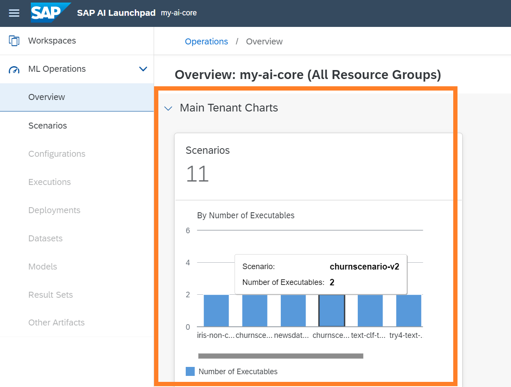
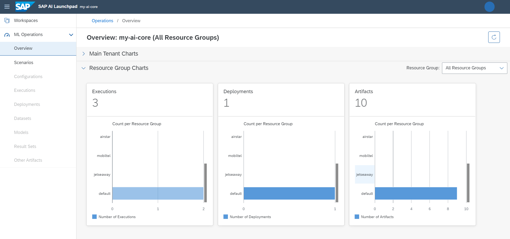

<!-- loiocd1387dbc31840698e0cb0018ff72028 -->

# Overview

The *ML Operations* app provides an overview of statistics for your scenarios within your SAP AI Core \(AI runtime\), used by your selected connection.

The *Overview* provides a dashboard for you to visualize the following:

-   Main tenant charts

    Visualization of all the scenarios \(created for all resource groups\) in your SAP AI Core \(AI runtime\). For more information, see [Resource Groups](https://help.sap.com/viewer/808d9d442fb0484e9b818924feeb9add/INTERNAL/en-US/26c6c6b50e3f412f8bc0cd6a8ebdb850.html).

    

-   Resource group charts

    Visualization of the following:

    -   Executions: number of trainings \(across all resource groups for the selected connection\)

    -   Deployments: number of active deployments \(across all resource groups for the selected connection\)

    -   Artifacts: number of registered datasets and models \(across all resource groups for the selected connection\)

    

