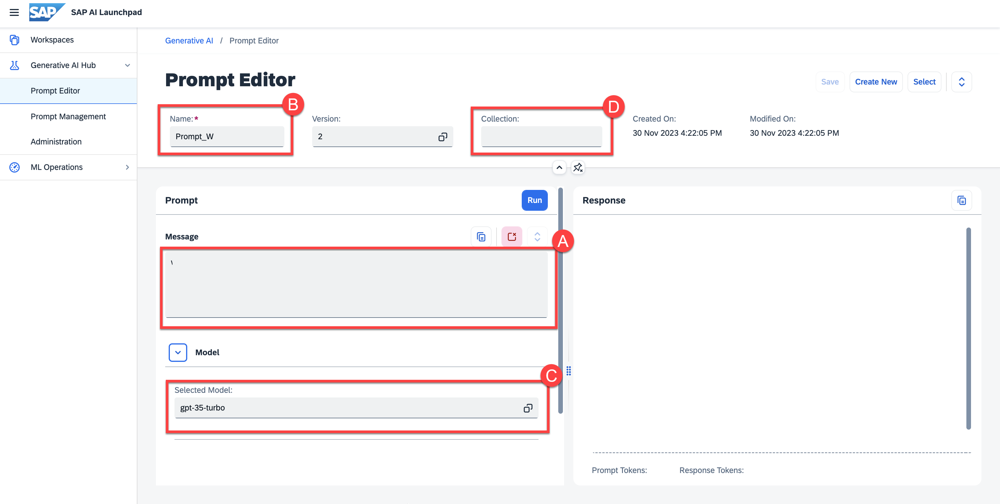
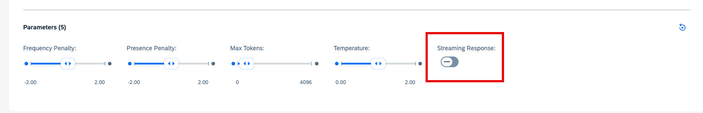
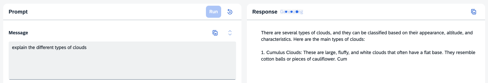

<!-- loio384cc0cd06dc464c8747cc58d5ebda3f -->

# Prompt Experimentation


<a name="loio384cc0cd06dc464c8747cc58d5ebda3f__prereq_gd3_lrc_bzb"/>

## Prerequisites

-   You have at least one deployment for a generative AI model running. For more information, see [Create a Deployment for a Generative AI Model](create-a-deployment-for-a-generative-ai-model-96b65bb.md).

-   You’ve selected the AI API connection and resource group that you used in the activation steps.

-   You have the `genai_manager`, `prompt_manager`, `genai_experimenter` or `prompt_experimenter` role, or you are assigned a role collection that contains one of these roles. For more information, see [Roles and Authorizations](roles-and-authorizations-4ef8499.md).

-   Users with only the `genai_experimenter` or `prompt_experimenter` roles are not able to save prompts.


<a name="loio384cc0cd06dc464c8747cc58d5ebda3f__context_qdl_xnp_rzb"/>

## Context

> ### Caution:  
> SAP does not take any responsibility for quality of the content in the input to or output of the underlying generative AI models, including but not limited to, bias, hallucinations, or inaccuracies. The user is responsible for verifying the content.


## Procedure

1.  Select the connection to your SAP AI Core runtime in the *Workspaces* app and choose the resource group that was used for your generative AI hub deployment.

2.  In the side navigation, expand the *Generative AI Hub* and choose *Prompt Editor*.

3.  Input your prompt:

    1.  Enter your input data in the *Message* box.


    2.  **Optional:** Enter a name for your prompt.

        Not available to the `genai_experimenter` or `prompt_experimenter` roles.

    3.  **Optional:** Choose a model.

        If you do not choose a model, the default model will be used.

    4.  **Optional:** Enter a collection name. Collection names are case sensitive.

        Not available to the `genai_experimenter` or `prompt_experimenter` roles.

    5.  **Optional:** Adjust the parameters to refine the generated response.


        > ### Tip:  
        > Different models support different parameters and values. For more information, see the documentation from the model provider. Also see [Models and Scenarios in the Generative AI Hub](models-and-scenarios-in-the-generative-ai-hub-fef463b.md).

    6.  **Optional:** Add meaningful tags and notes to the metadata.

        Not available to the `genai_experimenter` or `prompt_experimenter` roles.


    

4.  Choose *Run*.

    Some models support streaming for response generation. When the streaming switch is available, you can turn streaming on and off as needed.

    

    You will see your response as it generates.

    


<a name="loio384cc0cd06dc464c8747cc58d5ebda3f__result_xss_135_jzb"/>

## Results

The response to your prompt will be generated.


<a name="loio384cc0cd06dc464c8747cc58d5ebda3f__postreq_fsm_k35_jzb"/>

## Next Steps

-   You can run your prompt again, make changes to the prompt, model, and parameters to change the outcome.
-   You can save your prompt. For more information, see [Save a Prompt](save-a-prompt-e8c656f.md).

    Not available to the `genai_experimenter` or `prompt_experimenter` roles.

-   You can copy your prompt or response using the copy button.
-   You can expand the *Message* field using the expand button.

<a name="concept_w1t_nts_szb"/>

<!-- concept\_w1t\_nts\_szb -->

## Sample Prompts

<a name="concept_vfr_j1y_kzb"/>

<!-- concept\_vfr\_j1y\_kzb -->

### Question Answering

You can ask the LLM a question and receive a response written in natural language.

> ### Example:  
> Prompt:
> 
> `What is python in the context of programing?`

<a name="concept_cnd_scy_kzb"/>

<!-- concept\_cnd\_scy\_kzb -->

### Summarizing

You can provide the LLM with a text and ask for a summary of it.

> ### Example:  
> Prompt:
> 
> `Your task is to generate a short summary of a product review from an ecommerce site. Summarize the review below, delimited by triple backticks, in at most 30 words. Review: Got this panda plush toy for my daughter's birthday, who loves it and takes it everywhere. It's soft and super cute, and its face has a friendly look. It's a bit small for what I paid though. I think there might be other options that are bigger for the same price. It arrived a day earlier than expected, so I got to play with it myself before I gave it to her.`

> ### Example:  
> This example specifies topic focus points.
> 
> Prompt:
> 
> `Your task is to generate a short summary of a product review from an ecommerce site to give feedback to the pricing department, responsible for determining the price of the product. Summarize the review below, delimited by triple backticks, in at most 30 words, and focusing on any aspects that are relevant to the price and perceived value. Review: ```Got this panda plush toy for my daughter's birthday, who loves it and takes it everywhere. It's soft and super cute, and its face has a friendly look. It's a bit small for what I paid though. I think there might be other options that are bigger for the same price. It arrived a day earlier than expected, so I got to play with it myself before I gave it to her.`

> ### Example:  
> This example uses “extract” instead of “summarize”.
> 
> Prompt:
> 
> `Your task is to extract relevant information from a product review from an ecommerce site to give feedback to the Shipping department. From the review below, delimited by triple quotes extract the information relevant to shipping and delivery. Limit to 30 words. Review: ```Got this panda plush toy for my daughter's birthday,who loves it and takes it everywhere. It's soft and super cute, and its face has a friendly look. It's a bit small for what I paid though. I think there might be other options that are bigger for the same price. It arrived a day earlier than expected, so I got to play with it myself before I gave it to her.```` 

<a name="concept_z3j_wcy_kzb"/>

<!-- concept\_z3j\_wcy\_kzb -->

### Inferencing

Inferencing uses the information in a given text to draw a conclusion.

> ### Example:  
> This example performs a sentiment analysis on a product review.
> 
> Prompt:
> 
> `What is the sentiment of the following product review, which is delimited with triple backticks? Review text: ```Needed a nice lamp for my bedroom, and this one had additional storage and not too high of a price point. Got it fast. The string to our lamp broke during the transit and the company happily sent over a new one. Came within a few days as well. It was easy to put together. I had a missing part, so I contacted their support, and they very quickly got me the missing piece! Lumina seems to me to be a great company that cares about their customers and products!!````

> ### Example:  
> This example generates the sentiment as a one word response.
> 
> Prompt:
> 
> `What is the sentiment of the following product review, which is delimited with triple backticks? Give your answer as a single word, either 'positive' or 'negative' Review text: ```Needed a nice lamp for my bedroom, and this one had additional storage and not too high of a price point. Got it fast. The string to our lamp broke during the transit and the company happily sent over a new one. Came within a few days as well. It was easy to put together. I had a missing part, so I contacted their support and they very quickly got me the missing piece! Lumina seems to me to be a great company that cares about their customers and products!!````

> ### Example:  
> This example analyzes the emotions expressed in the review.
> 
> Prompt:
> 
> `Identify a list of emotions that the writer of the following review is expressing. Include no more than five items in the list. Format your answer as a list of lower-case words separated by commas. Review text: ```Needed a nice lamp for my bedroom, and this one had additional storage and not too high of a price point. Got it fast. The string to our lamp broke during the transit and the company happily sent over a new one. Came within a few days as well. It was easy to put together. I had a missing part, so I contacted their support and they very quickly got me the missing piece! Lumina seems to me to be a great company that cares about their customers and products!!`

> ### Example:  
> This example detects whether anger is present.
> 
> Prompt:
> 
> `Is the writer of the following review expressing anger? The review is delimited with triple backticks. Give your answer as either yes or no. Review text: ```Needed a nice lamp for my bedroom, and this one had additional storage and not too high of a price point. Got it fast. The string to our lamp broke during the transit and the company happily sent over a new one. Came within a few days as well. It was easy to put together. I had a missing part, so I contacted their support and they very quickly got me the missing piece! Lumina seems to me to be a great company that cares about their customers and products!!```` 

> ### Example:  
> This example detects product and company names from the customer review.
> 
> Prompt:
> 
> `Identify the following items from the review text: - Item purchased by reviewer - Company that made the item The review is delimited with triple backticks. Format your response as a JSON object with 'Item' and 'Brand' as the keys. If the information isn't present, use 'unknown' as the value. Make your response as short as possible. Review text: ```Needed a nice lamp for my bedroom, and this one had additional storage and not too high of a price point. Got it fast. The string to our lamp broke during the transit and the company happily sent over a new one. Came within a few days as well. It was easy to put together. I had a missing part, so I contacted their support and they very quickly got me the missing piece! Lumina seems to me to be a great company that cares about their customers and products!!``` 

> ### Example:  
> This example performs multiple tasks in a single query.
> 
> Prompt:
> 
> `Identify the following items from the review text: - Sentiment (positive or negative) - Is the reviewer expressing anger? (true or false) - Item purchased by reviewer - Company that made the item The review is delimited with triple backticks. Format your response as a JSON object with 'Sentiment', 'Anger', 'Item' and 'Brand' as the keys. If the information isn't present, use 'unknown' as the value. Make your response as short as possible. Review text: ```Needed a nice lamp for my bedroom, and this one had additional storage and not too high of a price point. Got it fast. The string to our lamp broke during the transit and the company happily sent over a new one. Came within a few days as well. It was easy to put together. I had a missing part, so I contacted their support and they very quickly got me the missing piece! Lumina seems to me to be a great company that cares about their customers and products!!````

> ### Example:  
> This example identifies the five topics discussed in a story.
> 
> Prompt:
> 
> `Determine five topics that are being discussed in the following text, which is delimited by triple backticks. Make each item one or two words long. Format your response as a list of items separated by commas. Text sample: '''In a recent survey conducted by the government, public sector employees were asked to rate their level of satisfaction with the department they work at. The results revealed that NASA was the most popular department with a satisfaction rating of 95%. One NASA employee, John Smith, commented on the findings, stating, 'I'm not surprised that NASA came out on top. It's a great place to work with amazing people and incredible opportunities. I'm proud to be a part of such an innovative organization.' The results were also welcomed by NASA's management team, with Director Tom Johnson stating, 'We are thrilled to hear that our employees are satisfied with their work at NASA. We have a talented and dedicated team who work tirelessly to achieve our goals, and it's fantastic to see that their hard work is paying off.' The survey also revealed that the Social Security Administration had the lowest satisfaction rating, with only 45% of employees indicating they were satisfied with their job. The government has pledged to address the concerns raised by employees in the survey and work towards improving job satisfaction across all departments.`

<a name="concept_cmh_ycy_kzb"/>

<!-- concept\_cmh\_ycy\_kzb -->

### Transformations

Transformations transform a given text into another language or register.

> ### Example:  
> This example translates text from English to Spanish.
> 
> Prompt:
> 
> `Translate the following English text to Spanish: ```Hi, I would like to order a blender```` 

> ### Example:  
> This example detects the language that the text is written in.
> 
> Prompt:
> 
> `Tell me which language this is: ```Combien coûte le lampadaire?````

> ### Example:  
> This example translates the given text into multiple languages.
> 
> Prompt:
> 
> `Translate the following text to French and Spanish and English pirate: ```I want to order a basketball````

> ### Example:  
> These examples translate both the language and register of the text.
> 
> Prompt:
> 
> `Translate the following text to Spanish in both the formal and informal forms: 'Would you like to order a pillow?`
> 
> Prompt:
> 
> `Translate the following from slang to a business letter: 'Dude, This is Joe, check out this spec on this standing lamp.` 

> ### Example:  
> This example translates between output formats. The prompt describes both the input and output format.
> 
> Prompt:
> 
> `Translate the following python dictionary from JSON to an HTML table with column headers and title:`
> 
> ```
> { "restaurant employees" :[  
> {"name":"Shyam", "email":"shyamjaiswal@gmail.com"}, 
> {"name":"Bob", "email":"bob32@gmail.com"}, 
> {"name":"Jai", "email":"jai87@gmail.com"} 
> ]}
> ```

> ### Example:  
> In these examples, a text is proofread. The text can be proofread and corrected, or simply proofread.
> 
> Prompt:
> 
> `Proofread and correct the following text and rewrite the corrected version. If you don't find and errors, just say \"No errors found\". Don't use any punctuation around the text: The girl with the black and white puppies have a ball.`

> ### Example:  
> Prompt:
> 
> `Proofread and correct the following text and rewrite the corrected version. If you don't find and errors, just say \"No errors found\". Don't use any punctuation around the text: Yolanda has her notebook.`

> ### Example:  
> Prompt:
> 
> `Proofread and correct this review: ```Got this for my daughter for her birthday cuz she keeps taking mine from my room. Yes, adults also like pandas too. She takes ears is a bit lower than the other, and I don't think that was designed to be asymmetrical. It's a bit small for what I paid for it though. I think there might be other options that are bigger for the same price. It arrived a day earlier than expected, so I got to play with it myself before I gave it to my daughter.```` 

<a name="concept_wzw_ql3_pzb"/>

<!-- concept\_wzw\_ql3\_pzb -->

### Expansions

Expansions generate text based on a prompt.

> ### Example:  
> This example generates an automated reply to a customer email.
> 
> Prompt:
> 
> `You are a customer service AI assistant. Your task is to send an email reply to a valued customer. Given the customer email delimited by ```, Generate a reply to thank the customer for their review. If the sentiment is positive or neutral, thank them for their review. If the sentiment is negative, apologize and suggest that they can reach out to customer service. Make sure to use specific details from the review. Write in a concise and professional tone. Sign the email as `AI customer agent`. Customer review: ```So, they still had the 17 piece system on seasonal sale for around $49 in the month of November, about half off, but for some reason (call it price gouging) around the second week of December the prices all went up to about anywhere from between $70-$89 for the same system. And the 11 piece system went up around $10 or so in price also from the earlier sale price of $29. So it looks okay, but if you look at the base, the part where the blade locks into place doesn’t look as good as in previous editions from a few years ago, but I plan to be very gentle with it (example, I crush very hard items like beans, ice, rice, etc. in the blender first then pulverize them in the serving size I want in the blender then switch to the whipping blade for a finer flour, and use the cross cutting blade first when making smoothies, then use the flat blade if I need them finer/less pulpy). Special tip when making smoothies, finely cut and freeze the fruits and vegetables (if using spinach-lightly stew soften the spinach then freeze until ready for use-and if making sorbet, use a small to medium sized food processor) that you plan to use that way you can avoid adding so much ice if at all-when making your smoothie. After about a year, the motor was making a funny noise. I called customer service but the warranty expired already, so I had to buy another one. FYI: The overall quality has gone done in these types of products, so they are kind of counting on brand recognition and consumer loyalty to maintain sales. Got it in about two days.``` Review sentiment: negative.` 

