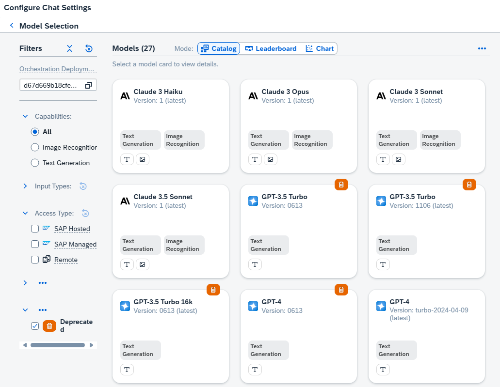
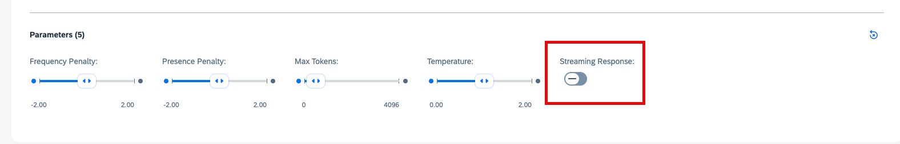

<!-- loio384cc0cd06dc464c8747cc58d5ebda3f -->

<link rel="stylesheet" type="text/css" href="css/sap-icons.css"/>

# Prompt Experimentation


<a name="loio384cc0cd06dc464c8747cc58d5ebda3f__prereq_gd3_lrc_bzb"/>

## Prerequisites

-   You have an orchestration deployment running. For more information, see [Create a Deployment for Orchestration](create-a-deployment-for-orchestration-4344c5b.md)

-   You’ve selected the AI API connection and resource group that you used in the activation steps.

-   You have the `genai_manager`, `prompt_manager`, `genai_experimenter` or `prompt_experimenter` role, or you are assigned a role collection that contains one of these roles. For more information, see [Roles and Authorizations](security-e4cf710.md#loio4ef8499d7a4945ec854e3b4590830bcc).

-   For image upload only: you have the `prompt_media_executor` role, or you are assigned a role collection that contains it. For more information, see [Roles and Authorizations](security-e4cf710.md#loio4ef8499d7a4945ec854e3b4590830bcc).

-   Users with only the `genai_experimenter` or `prompt_experimenter` roles are not able to save prompts.


<a name="loio384cc0cd06dc464c8747cc58d5ebda3f__context_qdl_xnp_rzb"/>

## Context

> ### Caution:  
> SAP doesn't take any responsibility for the quality of the content in the input to or output of the underlying generative AI models. This includes but isn't limited to bias, hallucinations, or inaccuracies. The user is responsible for verifying the content.


## Procedure

1.  Select the connection to your SAP AI Core runtime in the *Workspaces* app and choose the resource group that was used for your generative AI hub deployment.

2.  In the side navigation, expand the *Generative AI Hub* and choose *Prompt Editor*.

3.  Input your prompt:

    1.  **Optional:** Enter a name for your prompt.

        Not available to the `genai_experimenter` or `prompt_experimenter` roles.

    2.  **Optional:** Enter a collection name. Collection names are case sensitive.

        Not available to the `genai_experimenter` or `prompt_experimenter` roles.

    3.  You can open a saved template using the <span class="SAP-icons-V5"></span> \(select template\) icon, or create a new template by entering your input data in the *Message* boxand assign a role to your messge using the tabs. You can add more message blocks using the :heavy_plus_sign:.

        For selected models, image and pdf inputs are supported, and can be added using the <span class="SAP-icons-V5"></span> \(add document\)icon or copy and paste.

        Prompt messages are limited to 5.00mb across all inputs.

        > ### Tip:  
        > If the result of paste \([ctrl\] + [v\]  or [cmd\] + [v\] \) is not as expected, use [ctrl\] + [shift\] + [v\]  or [cmd\] + [shift\] + [v\] .

    4.  Use the <span class="SAP-icons-V5"></span> \(Syntax\) icon to add variables to your prompt, and define them in the *Variable Definitions* section.

    5.  **Optional:** Choose a model.

        If you do not choose a model, the default model will be used.

        When choosing a model, you can filter by input type.

        

    6.  **Optional:** Adjust the parameters to refine the generated response.


        > ### Tip:  
        > Different models support different parameters and values. For more information, see the documentation from the model provider. Also see [Models and Scenarios in the Generative AI Hub](models-and-scenarios-in-the-generative-ai-hub-fef463b.md).

    7.  **Optional:** Add tools to your prompt by definining actions that the model can perform.

        Tools must include a `type`, and a `function` object with a `name`, and be entered in JSON format.

        > ### Sample Code:  
        > ```
        > {
        >   "type": "function",
        >   "function": {
        >     "name": "get_inventory_quantity",
        >     "description": "Check available quantity for a product ID.",
        >     "strict": true,
        >     "parameters": {
        >       "type": "object",
        >       "properties": {
        >         "product_id": {
        >           "type": "integer"
        >         }
        >       },
        >       "required": [
        >         "product_id"
        >       ],
        >       "additionalProperties": false
        >     }
        >   }
        > }
        > ```

    8.  **Optional:** Add a response format to your prompt by definining an output schema for the model to follow.

        Response formats must have a `name` and be entered in JSON format.

        > ### Sample Code:  
        > ```
        > {
        >   "name": "facility_output",
        >   "strict": true,
        >   "schema": {
        >     "type": "object",
        >     "properties": {
        >       "urgency": {
        >         "type": "string",
        >         "description": "The urgency of the request",
        >         "enum": [
        >           "high",
        >           "medium",
        >           "low"
        >         ]
        >       },
        >       "categories": {
        >         "type": "object",
        >         "properties": {
        >           "emergency_repair_services": {
        >             "type": "boolean"
        >           },
        >           "routine_maintenance_requests": {
        >             "type": "boolean"
        >           }
        >         },
        >         "required": [
        >           "emergency_repair_services",
        >           "routine_maintenance_requests",
        >         ],
        >         "additionalProperties": false
        >       }
        >     },
        >     "required": [
        >       "urgency",
        >       "sentiment",
        >       "categories"
        >     ],
        >     "additionalProperties": false
        >   }
        > }
        > ```

    9.  **Optional:** Add meaningful tags and notes to the metadata.

        Not available to the `genai_experimenter` or `prompt_experimenter` roles.


4.  Choose *Run*.

    Selected models support streaming for response generation. When the streaming switch is available, you can turn streaming on and off as needed.

    

    You will see your response as it generates.


<a name="loio384cc0cd06dc464c8747cc58d5ebda3f__result_xss_135_jzb"/>

## Results

The response to your prompt will be generated.


<a name="loio384cc0cd06dc464c8747cc58d5ebda3f__postreq_fsm_k35_jzb"/>

## Next Steps

-   You can run your prompt again, make changes to the prompt, model, and parameters to change the outcome.
-   You can save your prompt. For more information, see [Save a Prompt](save-a-prompt-e8c656f.md).

    Not available to the `genai_experimenter` or `prompt_experimenter` roles.

-   You can save your template. For more information, see [Save a Template](save-a-template-49d4248.md).

    Not available to the `genai_experimenter` or `prompt_experimenter` roles.

-   You can copy text data from an individual chat message or response using the *copy* icon. Images will not be copied.

-   You can expand the *Message* field using the expand button.

