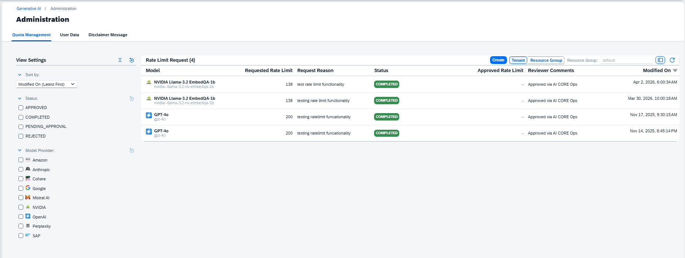
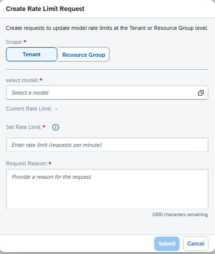

<!-- loio408e4706abda4a69b33e2cf221bea2b8 -->

<link rel="stylesheet" type="text/css" href="css/sap-icons.css"/>

# Quota Management

<a name="loio408e4706abda4a69b33e2cf221bea2b8__prereq_psc_hyb_rzb"/>

## Prerequisites

-   You have either the `genai_administrator` or `prompt_administrator` role, or you are assigned a role collection that contains one of these roles. For more information, see [Roles and Authorizations](security-e4cf710.md#loio4ef8499d7a4945ec854e3b4590830bcc).

## Procedure

1.  The *Quota Management* tab shows your existing rate limit increases.

    

    You can reduce the number of entries shown by using the filters.

    You can refresh the view using the  \(Refresh\) icon.

2.  Make a new rate limit request by choosing *Create*.

    Populate the wizard with the following:

    -   The scope of your request.
    -   Select a model.
    -   Your rate limit request.
    -   The reason for your request.

    

3.  Submit your request

## Results

Your request will be reviewed. You can check on it's status in the *Quota Management* tab.

