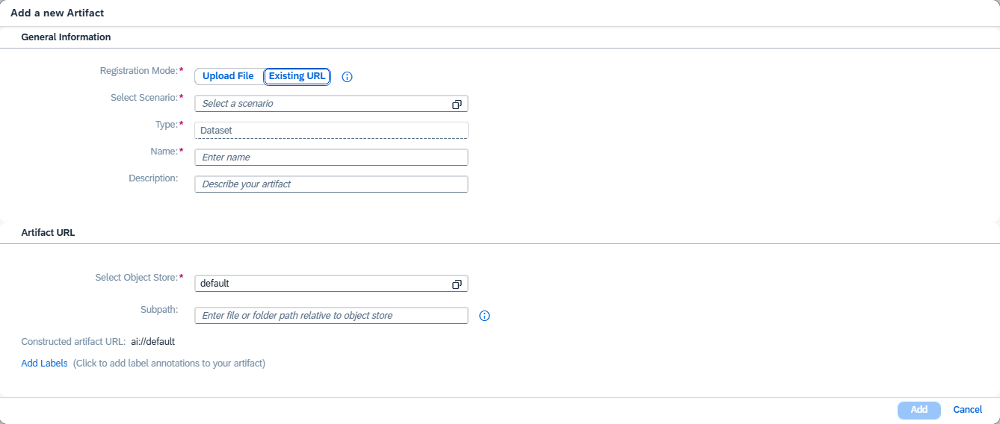

<!-- loio06ec70c426c047f99e3f7ce6db0ba70f -->

<link rel="stylesheet" type="text/css" href="css/sap-icons.css"/>

# Register an Artifact for Optimizations

<a name="loio06ec70c426c047f99e3f7ce6db0ba70f__prereq_kzx_stb_kgc"/>

## Prerequisites

-   You have the `genai_manager` or `custom_evaluation` role, or you are assigned a role collection that contains one of these roles. For more information, see [Roles and Authorizations](security-e4cf710.md#loio4ef8499d7a4945ec854e3b4590830bcc).

-   You're using the `extended` service plan. For more information, see [Service Plans](service-plans-ec1717d.md).

## Procedure

1.  Select the connection to your SAP AI Core runtime in the *Workspaces* app, and choose the resource group used for your generative AI hub deployment.

2.  In the side navigation, expand the *Generative AI Hub* and choose *Optimizations*.

3.  Choose the *Artifacts* tab and choose *Add*.

4.  Choose *Create*.

    A wizard appears to guide you through the process of uploading an artifact for optimizations.

5.  Complete the fields with information about your artifact

    1.  Choose a scenario

    2.  Give your artifact a name

    3.  **Optional:** Provide a description of your artifact

    4.  Choose *Add*

6.  Your can add a new artifact through the following methods:

    -   **Option 1:** Upload a file from your by choosing the *Upload File* switch

        > ### Restriction:  
        > Available to users with `genai_manager` or `custom_evaluation` roles only.

        1.  Add your object store
        2.  Specify a sub path, relative to your object store
        3.  Use the switch to specify whether or not your upload should replace an existing file
        4.  Select your file

        

    -   **Option 2:** Use an existing URL by choosing the *Existing URL* switch

        > ### Note:  
        > Users without `genai_manager` or `custom_evaluation` roles do not need to choose *Existing URL*

        1.  Add your object store
        2.  Specify a sub path, relative to your object store

        

7.  Add labels to your artifact by choosing *Add Labels*.

    You can add more labels using the :heavy_plus_sign: icon. You can delete labels using the :wastebasket: icon.

8.  Choose *Add*

<a name="loio06ec70c426c047f99e3f7ce6db0ba70f__result_ckf_c3z_kgc"/>

## Results

Your artifact is registered.

<a name="loio06ec70c426c047f99e3f7ce6db0ba70f__postreq_w5x_ttb_kgc"/>

## Next Steps

You can use your artifact as part of an evaluations workflow. For more information, see [Create an Evaluation](create-an-evaluation-c15182a.md).

You can use your artifact as part of a prompt optimizations workflow. For more information, see [Create a Prompt Optimization](create-a-prompt-optimization-0b920f6.md).

Users with the `genai_manager` or `custom_evaluation` role can update their artifact with new contents. Navigate to *Optimizations* \> *Artifact* \> *select your artifact* and choose *Update File* on the artifact details view.

