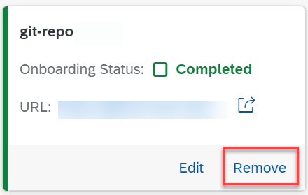

<!-- loio0701138c4c22499596f2666e0b251e88 -->

# Remove a Git Repository

As a system administrator, you can remove a Git repository from use within your training and serving processes.

<a name="loio0701138c4c22499596f2666e0b251e88__prereq_y2z_m2g_4xb"/>

## Prerequisites

You have the `aicore_admin_repositories_editor` role or a role collection that contains it. For more information, see [Roles and Authorizations](https://help.sap.com/docs/ai-launchpad/sap-ai-launchpad/roles-and-authorizations).

You have access to the Git repository over the Internet.

<a name="loio0701138c4c22499596f2666e0b251e88__context_bqm_42g_4xb"/>

## Context

You remove a Git repository from a connection if its URL is invalid or contains errors, or if the repo is no longer required. Once a Git repository is removed, it can no longer be selected as a source repository for an application.

<a name="loio0701138c4c22499596f2666e0b251e88__steps_g35_p2g_4xb"/>

## Procedure

1.  In the *Workspaces* app, choose the AI API connection.

2.  Open the *SAP AI Core Administration* app and choose *Git Repositories*.

    The *Git Repositories* screen appears with details of repositories for the connection, including name, status, and URL.

3.  Find the tile for the repo and choose *Remove*.

    

    The *Remove Git Repository* dialog box appears.

4.  Choose *Remove* to confirm the removal, and remove the repo from the connection.

<a name="loio0701138c4c22499596f2666e0b251e88__result_cnx_q2g_4xb"/>

## Results

The repo no longer appears on the *Git Repositories* screen. Any applications that use the removed repo as a source repository will no longer work.

