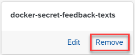

<!-- loio5161312a87b34805868b00404e7640d4 -->

# Remove a Secret

As a system administrator, you can remove Docker registry secrets used within your AI processes.

<a name="loio5161312a87b34805868b00404e7640d4__prereq_qmn_vgx_rxb"/>

## Prerequisites

You have the `aicore_admin_dockerregistrysecret_editor` role or a role collection that contains it. For more information, see [Roles and Authorizations](https://help.sap.com/docs/ai-launchpad/sap-ai-launchpad/roles-and-authorizations).

You have access to the Docker registry over the Internet.

<a name="loio5161312a87b34805868b00404e7640d4__context_f3s_vgx_rxb"/>

## Context

You remove a secret if the name is no longer valid or contains errors, or if the secret is no longer required.

<a name="loio5161312a87b34805868b00404e7640d4__steps_dcx_vgx_rxb"/>

## Procedure

1.  In the *Workspaces* app, choose the AI API connection.

2.  Open the *SAP AI Core Administration* app and choose *Docker Registry Secrets*.

    The *Docker Registry Secrets* screen appears with a tile for each existing secret.

3.  Find the tile for the secret and choose *Remove*.

    

    The *Remove Docker Registry Secret* dialog box appears.

4.  Choose *Remove* to confirm the removal, and remove the secret from your SAP AI Core instance.

<a name="loio5161312a87b34805868b00404e7640d4__result_lmb_wgx_rxb"/>

## Results

The secret no longer appears on the *Docker Registry Secret* screen. Any workflow or serving templates that use the removed secret to create executions or deployments no longer work.

