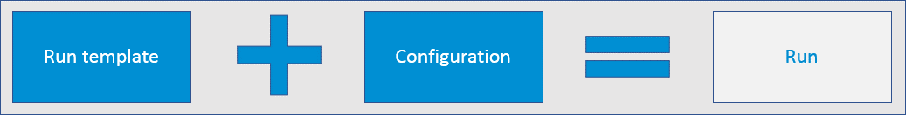
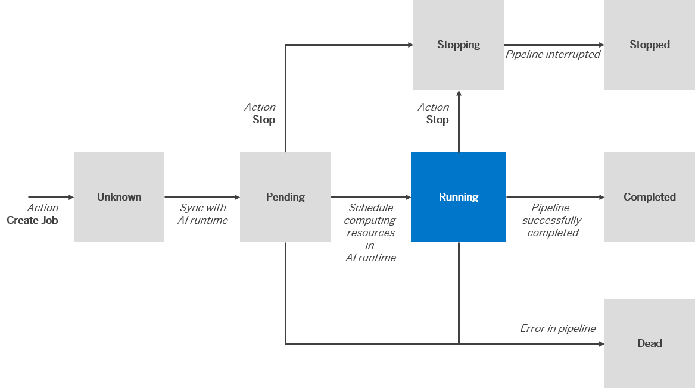

<!-- loio396875a7722d443e9f667c560a005166 -->

# Runs

A run is a training process that generates a model or models. A run is an instance of a run template \(an AI pipeline\), created using a configuration.

<a name="loio396875a7722d443e9f667c560a005166__section_hsc_pzv_xtb"/>

## About Runs

A run is used to train a model or for other AI workflows.

-   A run template defines the expected parameters, input dataset, and output model that is generated from the training process.

-   Values for parameters and input dataset are provided by a configuration.

-   A run is created to start the training process using the provided values.

-   A run generates a model.

Runs are associated with a large volume of metadata, as well as training/ model performance, and other training data. Metadata is stored as metrics \(and associated labels\), tags, and custom info. Multiple metrics, tags and custom info can be stored with a single run. Once metric, tag and custom info are saved to a run, they can be queried with a run ID.

You can view runs and individual run details in the *Functions Explorer* app, as follows:

-   To see runs for all scenarios, navigate to the *All Runs* screen.

-   To see runs for a specific scenario, navigate to the *All Scenarios* screen. Choose a scenario and select the *All Runs* tab.

For more information, see [Investigate a Run](investigate-a-run-e479244.md).

<a name="loio396875a7722d443e9f667c560a005166__section_itt_jzv_xtb"/>

## Runs and Models

You can expect to experiment iteratively with the datasets and configuration parameters until your model reaches the expected benchmark.

<a name="loio396875a7722d443e9f667c560a005166__section_fp4_bx4_5nb"/>

## Run States

Runs can have any of the following states:

-   Pending
-   Running
-   Stopping
-   Stopped
-   Completed
-   Dead
-   Unknown

The following figure shows how run states can change following the initial state of *Pending*:

  
  
**Run State Flow**

The AI runtime refers to the infrastructure of your subscribed AI service. When a run state changes from *Running* to the next state, the computing resources that were used by the AI runtime are released.

**Stop/Delete Behavior by State for Runs**

<table>
<tr>
<th valign="top">

State

</th>
<th valign="top">

Stop Run

</th>
<th valign="top">

Delete Run

</th>
</tr>
<tr>
<td valign="top">

Unknown

</td>
<td valign="top">

Not enabled

</td>
<td valign="top">

Enabled

</td>
</tr>
<tr>
<td valign="top">

Pending

</td>
<td valign="top">

Enabled

</td>
<td valign="top">

Not enabled

</td>
</tr>
<tr>
<td valign="top">

Running

</td>
<td valign="top">

Enabled

</td>
<td valign="top">

Not enabled

</td>
</tr>
<tr>
<td valign="top">

Completed

</td>
<td valign="top">

Not enabled

</td>
<td valign="top">

Enabled

</td>
</tr>
<tr>
<td valign="top">

Stopping

</td>
<td valign="top">

Not enabled

</td>
<td valign="top">

Not enabled

</td>
</tr>
<tr>
<td valign="top">

Stopped

</td>
<td valign="top">

Not enabled

</td>
<td valign="top">

Enabled

</td>
</tr>
<tr>
<td valign="top">

Dead

</td>
<td valign="top">

Not enabled

</td>
<td valign="top">

Enabled

</td>
</tr>
</table>

-   **[Investigate a Run](investigate-a-run-e479244.md "You can explore run details for detailed insights about the training process for a
		model. ")**  
You can explore run details for detailed insights about the training process for a model.
-   **[View the Metric Resource for a Run](view-the-metric-resource-for-a-run-d4f29aa.md "A metric is the measure of quality (confidence) of a model. During a run, metrics
		(standard model evaluation metrics and associated labels, tags and custom info) are  logged
		and stored by the run template.")**  
A metric is the measure of quality \(confidence\) of a model. During a run, metrics \(standard model evaluation metrics and associated labels, tags and custom info\) are logged and stored by the run template.
-   **[Compare Runs](compare-runs-b054876.md "You can compare runs to determine which configuration parameters result in optimum
		results.")**  
You can compare runs to determine which configuration parameters result in optimum results.
-   **[Create a Run](create-a-run-ebc7a62.md "A run is a training process which generates a model.")**  
A run is a training process which generates a model.
-   **[Stop a Run](stop-a-run-a68bde6.md "You can stop a run (training process) and release any computing resource acquired the
		run.")**  
You can stop a run \(training process\) and release any computing resource acquired the run.
-   **[Delete a Run](delete-a-run-543f58a.md "You can delete a run if it is no longer required. Deleting a run does not delete the
		objects associated with the run, such as the model, dataset, configuration, or run
		template.")**  
You can delete a run if it is no longer required. Deleting a run does not delete the objects associated with the run, such as the model, dataset, configuration, or run template.

