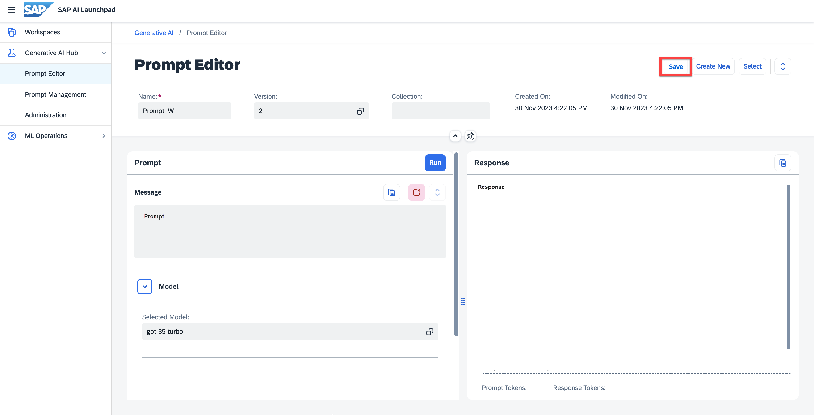

<!-- loioe8c656f9f51243dd8978dc1bc39d227d -->

# Save a Prompt

<a name="loioe8c656f9f51243dd8978dc1bc39d227d__prereq_k4k_dj5_jzb"/>

## Prerequisites

-   You have run a prompt successfully.

-   You have either the `genai_manager` or `prompt_manager` role, or you are assigned a role collection that contains one of these roles. For more information, see [Roles and Authorizations](roles-and-authorizations-4ef8499.md).

-   Users with only the `genai_experimenter` or `prompt_experimenter` roles are not able to save prompts.

<a name="loioe8c656f9f51243dd8978dc1bc39d227d__context_q5l_gbq_rzb"/>

## Context

Prompts are saved in one region only and can only be retrieved or deleted by an instance of AI launchpad in that region.

There is a storage limit applied at tenant level. If you reach this limit, you will receive an error message. Delete saved prompts to make space, or contact your administrator. Your prompt will not be saved and you will have to run it again to save it. You can use the copy function to paste it elsewhere for your reference.

## Procedure

1.  **Optional:** you can

    -   Give your prompt a descriptive *name* in place of the automatically assigned name.
    -   Assign your prompt to a *Collection*.
    -   Assign meaningful *Tags* and *Notes* as *Metadata*.

2.  Choose *Save.*

    > ### Caution:  
    > Do not store sensitive data in prompts when using the generative AI hub. Sensitive data is any data that is not intended for public disclosure, including but not limited to confidential or personal information.

    

