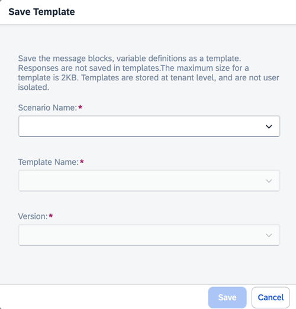

<!-- loio49d4248485644184ab3ca2ddf36119a6 -->

# Save a Template

<a name="loio49d4248485644184ab3ca2ddf36119a6__prereq_k4k_dj5_jzb"/>

## Prerequisites

-   Users with only the `genai_experimenter` or `prompt_experimenter` roles are not able to save prompts .For more information, see [Roles and Authorizations](security-e4cf710.md#loio4ef8499d7a4945ec854e3b4590830bcc).

<a name="loio49d4248485644184ab3ca2ddf36119a6__context_q5l_gbq_rzb"/>

## Context

Prompts are saved in one region only and can only be retrieved or deleted by an instance of AI launchpad in that region.

There is a storage limit applied at tenant level. If you reach this limit, you will receive an error message. Delete saved templates to make space, or contact your administrator. Your template will not be saved and you will have to run it again to save it. You can use the copy function to paste it elsewhere for your reference. You can check your storage consumption in the generative AI hub *Administration* section.

Templates containing images can't be saved.

## Procedure

1.  Choose *Save Template* and add the following to the dialogue box:

    -   Enter or select a scenrio name
    -   Enter or select a template name
    -   Enter or select a version

2.  Choose *Save*.

    > ### Caution:  
    > Do not store personally identifiable information in prompts when using the generative AI hub. Personally identifiable information is any data that can be used alone, or in combination, to identify the person that the data refers to.

    

