<!-- loioe4cf7102c2574e8b85f669b9c4f69cde -->

<link rel="stylesheet" type="text/css" href="css/sap-icons.css"/>

# Security

Here, we'll explain some of the security aspects of SAP AI Launchpad.

<a name="loiof1d2eb91d9a248ca8c92b0110c76c6f6"/>

<!-- loiof1d2eb91d9a248ca8c92b0110c76c6f6 -->

## Data Protection and Privacy

For general information about data protection and privacy on SAP Business Technology Platform, see [Data Protection and Privacy](https://help.sap.com/viewer/65de2977205c403bbc107264b8eccf4b/Cloud/en-US/7e513d31704a4a87831191e504ca850a.html).

Data protection is associated with numerous legal requirements and privacy concerns. In addition to compliance with general data protection and privacy acts, it is necessary to consider compliance with industry-specific legislation in different countries. SAP provides specific features and functions to support compliance with regard to relevant legal requirements, including data protection. SAP does not give any advice on whether these features and functions are the best method to support company, industry, regional, or country-specific requirements. Furthermore, this information should not be taken as advice or a recommendation regarding additional features that would be required in specific IT environments. Decisions related to data protection must be made on a case-by-case basis, taking into consideration the given system landscape and the applicable legal requirements.

> ### Note:  
> SAP does not provide legal advice in any form. SAP software supports data protection compliance by providing security features and specific data protection-relevant functions, such as simplified blocking and deletion of personal data. In many cases, compliance with applicable data protection and privacy laws will not be covered by a product feature. Definitions and other terms used in this document are not taken from a particular legal source.

SAP Data Protection and Privacy \(DPP\) requirements and the European Union's General Data Protection Regulations \(GDPR\) mandate the protection of personal and private data at higher standards than other customer data. SAP machine learning services do not import, output, or process any structured personal or private customer data, and cannot distinguish personal or private data from other types of data. Customers are therefore obliged to fulfill the GDPR personal data broker obligations if such data is present.

> ### Caution:  
> Do not store personally identifiable information in prompts when using the generative AI hub. Personally identifiable information is any data that can be used alone, or in combination, to identify the person that the data refers to.

<a name="loiof1d2eb91d9a248ca8c92b0110c76c6f6__section_w3k_wch_ynb"/>

## Read Access Logging

SAP AI Launchpad stores tenant id \(identity-zone, JWT token's zid\) in application and audit logs, which are sent to the ELK stack and audit log service respectively. SAP Business Technology Platform persists application logs in the ELK log-stash for 7 days.

<a name="loiof1d2eb91d9a248ca8c92b0110c76c6f6__section_yj3_fdh_ynb"/>

## Deletion

The audit log data stored for your account will be retained for 30 days, after which it will be deleted.

For users who are manually offboarded from the generative AI hub data deletion is triggered immediately.

For data deletion resulting from the deletion of a resource group, deletion is triggered within 24 hours.

For data deletion from the generative AI hub resulting from the removal of an SAP AI Core tenant, SAP AI Launchpad connection to SAP AI Core or SAP AI Launchpad instance, data will be retained for 30 days, after which it will be deleted.

> ### Note:  
> User data is saved in one region only and can only be retrieved or deleted by an instance of AI launchpad in that region.

<a name="loioab5939567cf04016854414774fb2291e"/>

<!-- loioab5939567cf04016854414774fb2291e -->

## Security and Customer Data Protection

SAP product standard security and the data protection and privacy \(DPP\) requirements set high standards and obligations when it comes to securing and protecting customer data that is entrusted to SAP.

Customer data protection is handled in three ways:

-   Customer data is imported, output, and processed by the services for no purpose beyond that to which the customer has subscribed.
-   Customer data is protected from malicious access by security technologies that include authentication and authorization.
-   Customer data is protected from accidental exposure to SAP administrators or support persons by security policies, access controls, and monitoring.

<a name="loio42a8f0fd505d4fdca3ed1dc1de14ca07"/>

<!-- loio42a8f0fd505d4fdca3ed1dc1de14ca07 -->

## Encryption in Transit

Communication with the service, including data upload and download, is encrypted using the transport layer security \(TLS\) protocol. SAP services support only the latest protocol versions \(that is, TLS v1.2 and later\) and strong cipher suites. Your systems must use the supported protocol versions and cipher suites to set up secure communication with the services. They must also validate the certificates against the services’ domain names to avoid man-in-the-middle attacks.

<a name="loiodef9ee82675a4cb3a0f718cfc8d940dc"/>

<!-- loiodef9ee82675a4cb3a0f718cfc8d940dc -->

## User Authentication and Authorization

SAP machine learning services use the advanced OAuth 2.0 protocol for authentication and authorization. Customer systems must implement strong protection to safeguard the authentication credentials \(client credentials\).

SAP AI Launchpad uses standard SAP Authorization and Trust Management service services, which lets you manage user authorizations and trust to identity providers.

SAP AI Launchpad integrates with the User Account and Authentication service \(SAP CP XSUAA\). This allows the federation of external and custom identity providers \(IdP\).

<a name="loiodef9ee82675a4cb3a0f718cfc8d940dc__section_crv_mch_ynb"/>

## Configuring External Identity Providers

Information on how to configure external identity providers is available in the SAP Business Technology Platform documentation:

-   For information about the configuration of identity providers via UAA, see [Data Protection and Privacy](https://help.sap.com/products/BTP/65de2977205c403bbc107264b8eccf4b/7e513d31704a4a87831191e504ca850a.html?version=Cloud).
-   For information about establishing trust between UAA and the Identity Authentication service \(IAS\), see [Establish Trust and Federation Between UAA and Identity Authentication](https://help.sap.com/viewer/65de2977205c403bbc107264b8eccf4b/Cloud/en-US/7c6aa87459764b179aeccadccd4f91f3.html).

The configuration is handled within the security configuration dashboard of the subaccount that contains the relevant instance.

<a name="loio4ef8499d7a4945ec854e3b4590830bcc"/>

<!-- loio4ef8499d7a4945ec854e3b4590830bcc -->

### Roles and Authorizations

SAP AI Launchpad provides default role collections that you can assign to users. The role collections determine which actions a user is able to carry out in SAP AI Launchpad. You can also create your own role collections and assign the required roles to them.

SAP AI Launchpad provides standard or default role collections. The default role collections bundle the roles required for likely SAP AI Launchpad tasks and app functions. However, if these role collections do not suit your organizational needs, you can create your own role collections.

**Default Role Collections**

<table>
<tr>
<th valign="top">

Relevance

</th>
<th valign="top">

Default Role Collection

</th>
<th valign="top">

Description

</th>
<th valign="top">

Includes Roles

</th>
</tr>
<tr>
<td valign="top">

SAP AI Launchpad 

</td>
<td valign="top">

`ailaunchpad_connections_editor` 

</td>
<td valign="top">

Provides roles to view, create, edit, and delete connections to your AI runtime \(for example, SAP AI Core\)

</td>
<td valign="top">

`viewer`

`connections_editor`

</td>
</tr>
<tr>
<td valign="top">

SAP AI Launchpad 

</td>
<td valign="top">

`ailaunchpad_allow_all_resourcegroups` 

</td>
<td valign="top">

Provides access to all resource groups

</td>
<td valign="top">

`allow_all_resourcegroups` 

</td>
</tr>
<tr>
<td valign="top">

*ML Operations* 

</td>
<td valign="top">

`ailaunchpad_mloperations_viewer` 

</td>
<td valign="top">

Provides roles to view all contents of scenarios and resource groups

</td>
<td valign="top">

`viewer`

`mloperations_viewer`

</td>
</tr>
<tr>
<td valign="top">

*ML Operations* 

</td>
<td valign="top">

`ailaunchpad_mloperations_editor` 

</td>
<td valign="top">

Provides roles to view all contents of scenarios, and to view and edit contents of resource groups

</td>
<td valign="top">

`viewer`

`mloperations_editor`

</td>
</tr>
<tr>
<td valign="top">

*SAP AI Core Administration*

</td>
<td valign="top">

`ailaunchpad_aicore_admin_viewer`

</td>
<td valign="top">

Provides roles to view authentications required for AI workflows involving SAP AI Core \(AI runtime\)

</td>
<td valign="top">

`viewer`

`aicore_admin_viewer_all`

</td>
</tr>
<tr>
<td valign="top">

*SAP AI Core Administration*

</td>
<td valign="top">

`ailaunchpad_aicore_admin_editor`

</td>
<td valign="top">

Provides roles to edit authentications required for AI workflows involving SAP AI Core \(AI runtime\)

</td>
<td valign="top">

`viewer`

`aicore_admin_editor_all` 

</td>
</tr>
<tr>
<td valign="top">

*Functions Explorer* 

</td>
<td valign="top">

`ailaunchpad_functions_explorer_viewer_v2` 

</td>
<td valign="top">

Provides roles to view scenarios and all ML resources of a scenario

</td>
<td valign="top">

`viewer`

`connections_viewer`

`functions_explorer`

`mlfunctions_viewer`

`scenario_executable_viewer`

`scenario_metadata_viewer`

`scenario_configuration_viewer`

`scenario_job_viewer`

`scenario_artifact_viewer`

`scenario_metric_viewer`

</td>
</tr>
<tr>
<td valign="top">

*Functions Explorer* 

</td>
<td valign="top">

`ailaunchpad_functions_explorer_editor_v2` 

</td>
<td valign="top">

Edit scenarios and all ML resources of a scenario

</td>
<td valign="top">

`viewer`

`connections_viewer`

`functions_explorer`

`mlfunctions_editor`

`scenario_executable_viewer`

`scenario_metadata_viewer`

`scenario_metric_viewer`

`scenario_configuration_editor`

`scenario_job_editor`

`scenario_artifact_editor`

</td>
</tr>
<tr>
<td valign="top">

SAP AI Launchpad

</td>
<td valign="top">

`ailaunchpad_connections_editor_without_genai`

</td>
<td valign="top">

Provides roles to view, create, edit, and delete connections to your AI runtime \(for example, SAP AI Core\) without generative AI hub

</td>
<td valign="top">

`viewer_without_genai`

`connections_editor`

</td>
</tr>
<tr>
<td valign="top">

*ML Operations*

</td>
<td valign="top">

`ailaunchpad_mloperations_viewer_without_genai` 

</td>
<td valign="top">

Provides roles to view all contents of scenarios and resource groups without generative AI hub 

</td>
<td valign="top">

`viewer_without_genai`

`mloperations_viewer`

</td>
</tr>
<tr>
<td valign="top">

*ML Operations*

</td>
<td valign="top">

`ailaunchpad_mloperations_editor_without_genai` 

</td>
<td valign="top">

Provides roles to view all contents of scenarios, and to view and edit contents of resource groups without generative AI hub 

</td>
<td valign="top">

`viewer_without_genai`

`mloperations_editor`

</td>
</tr>
<tr>
<td valign="top">

*Functions Explorer*

</td>
<td valign="top">

`ailaunchpad_functions_explorer_viewer_v2_without_genai` 

</td>
<td valign="top">

Provides roles to view scenarios and all ML resources of a scenario without generative AI hub 

</td>
<td valign="top">

`viewer_without_genai`

`connections_viewer`

`functions_explorer`

`mlfunctions_viewer`

`scenario_executable_viewer`

`scenario_metadata_viewer`

`scenario_configuration_viewer`

`scenario_job_viewer`

`scenario_artifact_viewer`

`scenario_metric_viewer`

</td>
</tr>
<tr>
<td valign="top">

*Functions Explorer*

</td>
<td valign="top">

`ailaunchpad_functions_explorer_editor_v2_without_genai` 

</td>
<td valign="top">

Edit scenarios and all ML resources of a scenario without generative AI hub 

</td>
<td valign="top">

`viewer_without_genai`

`connections_viewer`

`functions_explorer`

`mlfunctions_editor`

`scenario_executable_viewer`

`scenario_metadata_viewer`

`scenario_metric_viewer`

`scenario_configuration_editor`

`scenario_job_editor`

`scenario_artifact_editor`

</td>
</tr>
<tr>
<td valign="top">

*SAP AI Core Administration*

</td>
<td valign="top">

`ailaunchpad_aicore_admin_viewer_without_genai`

</td>
<td valign="top">

Administrator \(SAP AI Core\) viewer, without access to generative AI hub

</td>
<td valign="top">

`viewer_without_genai`

`aicore_admin_viewer_all`

</td>
</tr>
<tr>
<td valign="top">

*SAP AI Core Administration*

</td>
<td valign="top">

`ailaunchpad_aicore_admin_editor_without_genai`

</td>
<td valign="top">

Administrator \(SAP AI Core\) editor, without access to generative AI hub

</td>
<td valign="top">

`viewer_without_genai`

`aicore_admin_editor_all`

</td>
</tr>
<tr>
<td valign="top">

*Generative AI Hub*

</td>
<td valign="top">

`ailaunchpad_genai_experimenter`

</td>
<td valign="top">

Prompt experimentation, viewing disclaimers and orchestration experimentation in generative AI hub.

</td>
<td valign="top">

`viewer_without_genai`

`genai_experimenter`

</td>
</tr>
<tr>
<td valign="top">

*Generative AI Hub*

</td>
<td valign="top">

`ailaunchpad_genai_manager`

</td>
<td valign="top">

Prompt experimentation, managing prompts, viewing disclaimers and orchestration experimentation in generative AI hub.

</td>
<td valign="top">

`viewer_without_genai`

`genai_experimenter`

`genai_manager`

</td>
</tr>
<tr>
<td valign="top">

*Generative AI Hub*

</td>
<td valign="top">

`ailaunchpad_genai_administrator`

</td>
<td valign="top">

Administration user data deletion and reading, writing and deletion of disclaimers in generative AI hub.

</td>
<td valign="top">

`viewer_without_genai`

`genai_administrator`

</td>
</tr>
</table>

If you want to create your own role collections, you can assign roles to them based on the following table.

**Default Roles**

<table>
<tr>
<th valign="top">

Role

</th>
<th valign="top">

Allows Users To

</th>
</tr>
<tr>
<td valign="top">

`allow_connections` 

</td>
<td valign="top">

Manage custom access to runtime connections in SAP AI Launchpad 

</td>
</tr>
<tr>
<td valign="top">

`connections_viewer`

</td>
<td valign="top">

View runtime connections in SAP AI Launchpad 

</td>
</tr>
<tr>
<td valign="top">

`connections_editor` 

</td>
<td valign="top">

Edit runtime connections in SAP AI Launchpad 

</td>
</tr>
<tr>
<td valign="top">

`viewer` 

</td>
<td valign="top">

Access SAP AI Launchpad \(default role for all users\)

</td>
</tr>
<tr>
<td valign="top">

`aicore_admin_repositories_viewer`

</td>
<td valign="top">

View Git repositories in the *SAP AI Core Administration* app

</td>
</tr>
<tr>
<td valign="top">

`aicore_admin_repositories_editor`

</td>
<td valign="top">

Add, edit, or remove Git repositories in the *SAP AI Core Administration* app

</td>
</tr>
<tr>
<td valign="top">

`aicore_admin_applications_viewer`

</td>
<td valign="top">

View applications in the *SAP AI Core Administration* app

</td>
</tr>
<tr>
<td valign="top">

`aicore_admin_applications_editor`

</td>
<td valign="top">

Create, edit, or delete applications in the *SAP AI Core Administration* app

</td>
</tr>
<tr>
<td valign="top">

`aicore_admin_dockerregistrysecret_viewer`

</td>
<td valign="top">

View Docker registry secrets in the *SAP AI Core Administration* app

</td>
</tr>
<tr>
<td valign="top">

`aicore_admin_dockerregistrysecret_editor`

</td>
<td valign="top">

Add, edit, or remove Docker registry secrets in the *SAP AI Core Administration* app

</td>
</tr>
<tr>
<td valign="top">

`aicore_admin_resourcegroup_viewer`

</td>
<td valign="top">

View resource groups in the *SAP AI Core Administration* app

</td>
</tr>
<tr>
<td valign="top">

`aicore_admin_resourcegroup_editor`

</td>
<td valign="top">

Create, edit, or delete resource groups in the *SAP AI Core Administration* app

</td>
</tr>
<tr>
<td valign="top">

`aicore_admin_objectstoresecret_viewer`

</td>
<td valign="top">

View object store secrets in the *SAP AI Core Administration* app

</td>
</tr>
<tr>
<td valign="top">

`aicore_admin_objectstoresecret_editor`

</td>
<td valign="top">

Add, edit, or remove object store secrets in the *SAP AI Core Administration* app

</td>
</tr>
<tr>
<td valign="top">

`scenario_metadata_viewer` 

</td>
<td valign="top">

View scenarios and scenario versions

</td>
</tr>
<tr>
<td valign="top">

`scenario_executable_viewer` 

</td>
<td valign="top">

View executables of a scenario

</td>
</tr>
<tr>
<td valign="top">

`scenario_configuration_viewer` 

</td>
<td valign="top">

View configurations of a scenario

</td>
</tr>
<tr>
<td valign="top">

`scenario_configuration_editor` 

</td>
<td valign="top">

Edit configurations of a scenario

</td>
</tr>
<tr>
<td valign="top">

`scenario_deployment_viewer` 

</td>
<td valign="top">

View deployments of a scenario

</td>
</tr>
<tr>
<td valign="top">

`scenario_deployment_editor` 

</td>
<td valign="top">

Edit deployments of a scenario

</td>
</tr>
<tr>
<td valign="top">

`scenario_deployment_predictor` 

</td>
<td valign="top">

Invoke deployments of a scenario

</td>
</tr>
<tr>
<td valign="top">

`scenario_execution_viewer` 

</td>
<td valign="top">

View executions of a scenario

</td>
</tr>
<tr>
<td valign="top">

`scenario_execution_editor` 

</td>
<td valign="top">

Edit executions of a scenario

</td>
</tr>
<tr>
<td valign="top">

`scenario_artifact_viewer` 

</td>
<td valign="top">

View artifacts of a scenario

</td>
</tr>
<tr>
<td valign="top">

`scenario_artifact_editor` 

</td>
<td valign="top">

Edit artifacts of a scenario

</td>
</tr>
<tr>
<td valign="top">

`scenario_metric_viewer` 

</td>
<td valign="top">

View tracking metrics of an execution

</td>
</tr>
<tr>
<td valign="top">

`resourcegroup_viewer` 

</td>
<td valign="top">

View resource groups

</td>
</tr>
<tr>
<td valign="top">

`allow_all_resourcegroups` 

</td>
<td valign="top">

Template for allowing access to all resource groups for a connection

</td>
</tr>
<tr>
<td valign="top">

`functions_explorer` 

</td>
<td valign="top">

Template for viewing functions explorer for SAP AI Launchpad 

</td>
</tr>
<tr>
<td valign="top">

`operations_manager` 

</td>
<td valign="top">

Template for viewing operations manager for SAP AI Launchpad 

</td>
</tr>
<tr>
<td valign="top">

`scenario_job_viewer` 

</td>
<td valign="top">

View jobs of a scenario

</td>
</tr>
<tr>
<td valign="top">

`scenario_job_editor` 

</td>
<td valign="top">

Edit jobs of a scenario

</td>
</tr>
<tr>
<td valign="top">

`mloperations_viewer` 

</td>
<td valign="top">

Viewer role for *ML Operations* app

</td>
</tr>
<tr>
<td valign="top">

`mloperations_editor` 

</td>
<td valign="top">

Editor role for *ML Operations* app

</td>
</tr>
<tr>
<td valign="top">

`artifact_register`

</td>
<td valign="top">

Register artifacts in *ML Operations* app

</td>
</tr>
<tr>
<td valign="top">

`mlfunctions_viewer`

</td>
<td valign="top">

Viewer role *Functions Explorer* app

</td>
</tr>
<tr>
<td valign="top">

`mlfunctions_editor`

</td>
<td valign="top">

Editor role *Functions Explorer* app

</td>
</tr>
<tr>
<td valign="top">

`aicore_admin_viewer_all` 

</td>
<td valign="top">

Viewer role *SAP AI Core Administration* app

</td>
</tr>
<tr>
<td valign="top">

`aicore_admin_editor_all` 

</td>
<td valign="top">

Editor role *SAP AI Core Administration* app

</td>
</tr>
<tr>
<td valign="top">

`execution_schedules_editor`

</td>
<td valign="top">

Edit execution schedules

</td>
</tr>
<tr>
<td valign="top">

`execution_schedules_viewer`

</td>
<td valign="top">

View execution schedules

</td>
</tr>
<tr>
<td valign="top">

`aicore_admin_genericsecret_editor`

</td>
<td valign="top">

Create, edit or delete generic secrets in the SAP AI Core runtime through the *SAP AI Core Administration* app

</td>
</tr>
<tr>
<td valign="top">

`aicore_admin_genericsecret_viewer`

</td>
<td valign="top">

View generic secrets in the SAP AI Core runtime through the *SAP AI Core Administration* app

</td>
</tr>
<tr>
<td valign="top">

`genai_experimenter`

</td>
<td valign="top">

Run prompts in the <code>generative AI hub prompt editor</code>

Build and test orchestration workflows in the <code>generative AI hub orchestration service</code>

Explore available models in the generative AI hub and make an informed model selection using the model library

</td>
</tr>
<tr>
<td valign="top">

`genai_manager`

</td>
<td valign="top">

Create, update and run prompts in the <code>generative AI hub prompt editor</code>, read and delete your saved prompts in the <code>generative AI hub</code> prompt managerBuild and test orchestration workflows in the <code>generative AI hub orchestration service</code>

Explore available models in the generative AI hub and make an informed model selection using the model library

</td>
</tr>
<tr>
<td valign="top">

`genai_administrator`

</td>
<td valign="top">

Delete user data in the **generative AI hub**

Explore available models in the generative AI hub and make an informed model selection using the model library

</td>
</tr>
<tr>
<td valign="top">

`prompt_experimenter`

</td>
<td valign="top">

Run prompts in the <code>generative AI hub prompt editor</code>. Build and test orchestration workflows in the <code>generative AI hub orchestration service</code>

</td>
</tr>
<tr>
<td valign="top">

`prompt_manager`

</td>
<td valign="top">

Create, update and run prompts in the <code>generative AI hub prompt editor</code>, read and deleted your saved prompts in the <code>generative AI hub</code> prompt manager

</td>
</tr>
<tr>
<td valign="top">

`prompt_administrator`

</td>
<td valign="top">

Delete user data in the generative AI hub. Create, edit or delete disclaimers in the generative AI hub.

</td>
</tr>
<tr>
<td valign="top">

`viewer_without_genai` 

</td>
<td valign="top">

Access SAP AI Launchpad, default role for users, without generative AI hub 

</td>
</tr>
<tr>
<td valign="top">

`orchestration_executor` 

</td>
<td valign="top">

Build and test orchestration workflows in the <code>generative AI hub orchestration service</code>

Explore available models in generative AI hub and make an informed model selection using the model library

</td>
</tr>
<tr>
<td valign="top">

`prompt_media_executor` 

</td>
<td valign="top">

Upload images in the <code>generative AI hub chat and prompt editor</code>.

</td>
</tr>
<tr>
<td valign="top">

`grounding_manager`

</td>
<td valign="top">

View, create and delete document repositories and pipelines in the grounding management app in generative AI hub.

</td>
</tr>
<tr>
<td valign="top">

`grounding_viewer`

</td>
<td valign="top">

View document repositories and pipelines in the grounding management app in generative AI hub.

</td>
</tr>
</table>

> ### Note:  
> Generative AI hub is available through the default `viewer` role.
> 
> Access to the generative AI hub can be revoked by assigning the equivalent role `without_genai`. For example, the `viewer` and `viewer_without_genai` are equivalent roles, with and without generative AI hub capabilities respectively.

**Related Information**  

[Functions Explorer](functions-explorer-90586e6.md "")

[Workspaces](workspaces-6bde2c8.md "The Workspaces app is a dashboard to manage the connection between SAP AI Launchpad and subscribed AI services.")

[Administration](administration-cb4dd1e.md "You use the SAP AI Core Administration app in SAP AI Launchpad to manage administration activities for your SAP AI Core runtime.")

<a name="loio9cdb1ea43b4e4243a7fc5d4f2a656700"/>

<!-- loio9cdb1ea43b4e4243a7fc5d4f2a656700 -->

### Create Role Collection

You create your own role collections and assign roles to them so that you can further manage users' access to content within SAP AI Launchpad.

<a name="loio9cdb1ea43b4e4243a7fc5d4f2a656700__prereq_ccd_jpq_h5b"/>

## Prerequisites

## Context

You create custom role collections to manage access settings for the following:

-   *Workspaces* app users, so that applicable resource groups are available to nominated users

-   *Workspaces* app users, so that applicable connections are available to nominated users
-   SAP Support users, so that they have custom access to available connections in your organization

## Procedure

1.  In SAP BTP cockpit, navigate to your subaccount and choose *Role Collections*.

    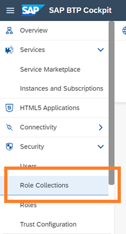

2.  Choose :heavy_plus_sign: to add a role collection.

    > ### Remember:  
    > A role collection groups roles and users \(and their email IDs\) with a shared persona.

    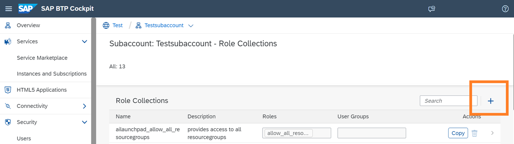

3.  Enter a name and description for the group of target users and choose *Create*.

    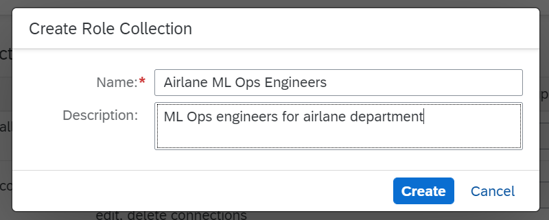

4.  Choose *Edit* to add nominated users to this role collection.

    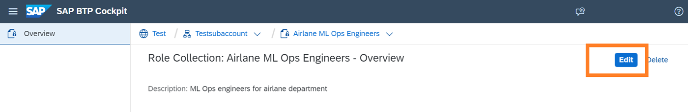

5.  Enter the email ID of the nominated user and choose *Save*.

    If required, you can add more users \(and their emails IDs\) by choosing :heavy_plus_sign:.

    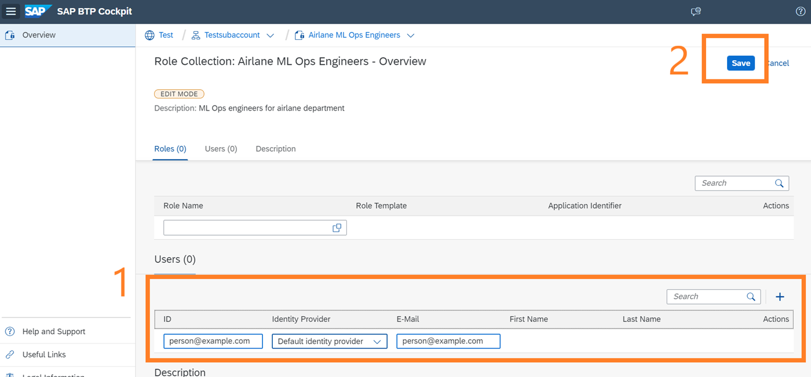

6.  Choose *Save* to save the role collection.

    The role collection is now listed in the SAP BTP Cockpit and is available for assignment. For example, you can use the role collection to manage custom access for resource groups or connections. See [Custom Access for Connections](security-e4cf710.md#loio8ba6a922e774468d91df127725603bdf) and [Custom Access for Resource Groups](security-e4cf710.md#loio19e39328d7f44af6b3b8a83983bde325).

<a name="loio8ba6a922e774468d91df127725603bdf"/>

<!-- loio8ba6a922e774468d91df127725603bdf -->

### Custom Access for Connections

You can selectively control users' access to connections within SAP AI Launchpad.

<a name="loio8ba6a922e774468d91df127725603bdf__prereq_nxk_h4q_h5b"/>

## Prerequisites

You have created a role collection for use with custom connections. See [Create Role Collection](security-e4cf710.md#loio9cdb1ea43b4e4243a7fc5d4f2a656700).

## Context

A role collection represents a shared user persona. A role collection groups roles and users \(and their email IDs\) who complete similar tasks.

By default, users of the *Workspaces* app have access to all the connections in their AI runtime. You provide custom access to selectively show connections to nominated roles and users.

> ### Tip:  
> For example, you may selectively control access if some connections involve sensitive data, or to simplify the selection options for users. You may also selectively provide access to an SAP Support user. See [Custom Access for Support User](security-e4cf710.md#loioa2a95a064e5b48db8d5abc7847067a9f).

You manage access to connections by creating a custom role collection within SAP AI Launchpad, and assigning it a role based on the `allow_connections` role template. Nominated users within the *Workspaces* app, are then shown only the connections applicable for their work.

<a name="loio8ba6a922e774468d91df127725603bdf__steps_nj2_mlq_h5b"/>

## Procedure

1.  In SAP BTP cockpit, navigate to your subaccount and choose *Roles* to access the list of roles.

    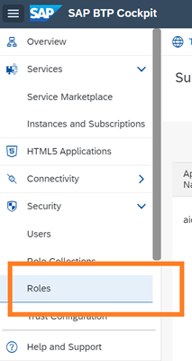

2.  Within the `ailaunchpad` application, find the `allow_connections` role template and choose *Create Role*.

3.  Complete the role details.

    1.  In the *Configure Role* wizard step, enter a name and description for the group of target users. You'll see that the `allow_connections` role template is automatically assigned to the role. Choose *Next* to continue.

    2.  In the *Configure Attributes* wizard step, enter the required connections in the *Values* column for the attribute `allow_connections`. Choose *Next* to continue.

        > ### Tip:  
        > To enter multiple connections, press *Enter* between connections and confirm the connection name. If you enter a value of `all`, you override any other connection value entered. This restores the system default and any custom settings are ignored.

    3.  In the *Select Role Collections* wizard step, search for and select the custom role collection that you've created for custom connections access. Choose *Next* to continue.

    4.  In the *Review* wizard step, check the role details and choose *Finish*.

<a name="loio8ba6a922e774468d91df127725603bdf__result_mxw_55q_hbi"/>

## Results

The role is now listed in the SAP BTP cockpit and the custom connection settings are applied. Users assigned to the `allow_connections` role \(or a role collection that contains it\), now have custom access to connections in their *Workspaces* app.

**Related Information**  

[Assign Connection to Workspace](set-resource-group-0c07728.md#loioa0204f94a94e4407abf772e76104d834 "")

<a name="loio19e39328d7f44af6b3b8a83983bde325"/>

<!-- loio19e39328d7f44af6b3b8a83983bde325 -->

### Custom Access for Resource Groups

You can selectively control users' access to resource groups \(within an AI runtime connection\) in SAP AI Launchpad.

<a name="loio19e39328d7f44af6b3b8a83983bde325__prereq_cl3_ht3_1rb"/>

## Prerequisites

You are using the standard role collection, or you have created a role collection for use with custom resource groups. See [Create Role Collection](security-e4cf710.md#loio9cdb1ea43b4e4243a7fc5d4f2a656700).

The users do not have the role collection `ailaunchpad_allow_all_resourcegroups` assigned.

<a name="loio19e39328d7f44af6b3b8a83983bde325__context_w15_fzq_h5b"/>

## Context

You can selectively control access to resource groups within an AI runtime connection. Nominated users of the *Workspaces* app, are then shown only those resource groups which are applicable for their work.

## Procedure

1.  In SAP BTP cockpit, navigate to your subaccount and choose *Roles* to access the list of roles.

    

2.  Within the `ailaunchpad` application, find the `allow_all_resourcegroups` role template, and choose *Add Using Same Role Template*.

    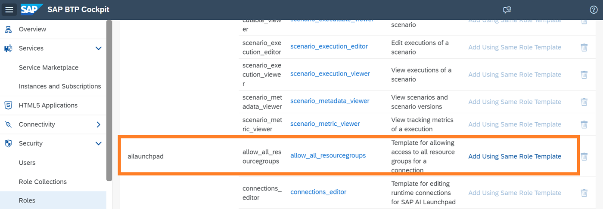

    The *Create Role* wizard appears.

3.  Complete the role details.

    1.  In the *Configure Role* wizard step, enter a name and description for the group of target users. You'll see that the `allow_all_resourcegroups` role template is automatically assigned to the role. Choose *Next* to continue.

        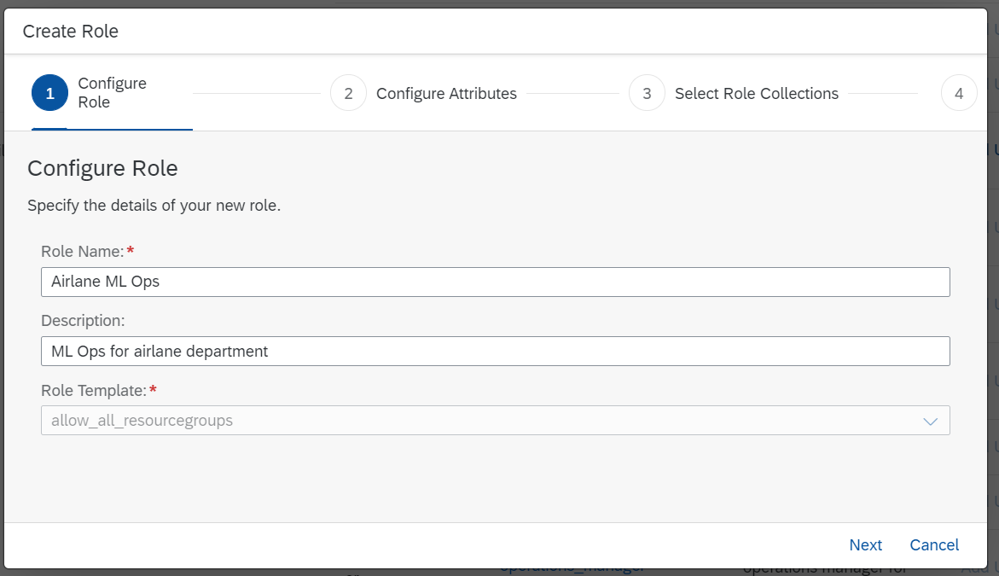

    2.  In the *Configure Attributes* wizard step, enter the required resource group IDs in the *Values* column for the attribute `allowed_all_resourcegroups`. Choose *Next* to continue.

        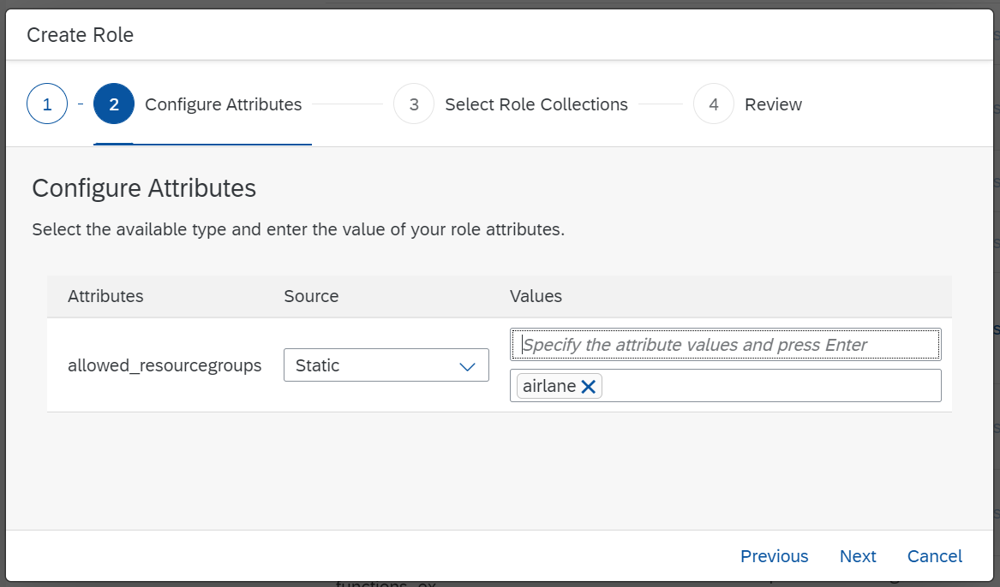

    3.  In the *Select Role Collections* wizard step, search for and select the custom role collection that you've created for custom access. Choose *Next* to continue.

        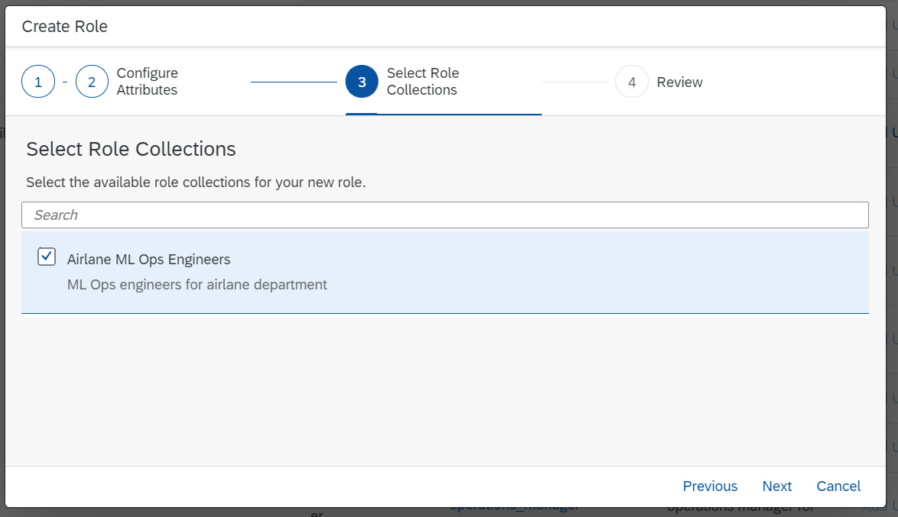

    4.  In the *Review* wizard step, check the role details and choose *Finish*.

        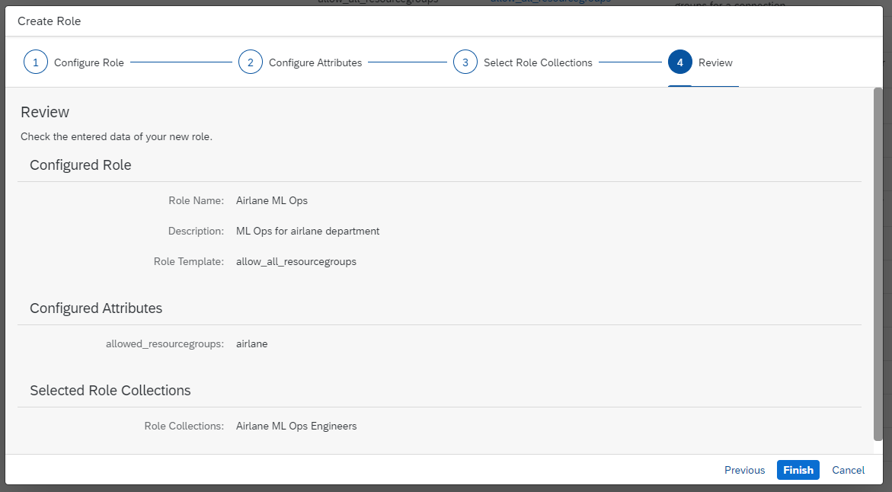

<a name="loio19e39328d7f44af6b3b8a83983bde325__result_mxw_55q_gab"/>

## Results

The role is now listed in the SAP BTP cockpit and the custom resource group settings are applied. Users currently assigned to the `allow_all_resource_groups` role \(or a role collection that contains it\), now have custom access to resource groups in their *Workspaces* app.

**Related Information**  

[Assign Resource Group to Workspace](set-resource-group-0c07728.md#loio1fe43ac042ab46749bec34b50601dce0 " ")

<a name="loioa2a95a064e5b48db8d5abc7847067a9f"/>

<!-- loioa2a95a064e5b48db8d5abc7847067a9f -->

### Custom Access for Support User

An SAP Support user may provide troubleshooting support in case of issues in your production environment.

<a name="loioa2a95a064e5b48db8d5abc7847067a9f__context_fnj_qsm_brb"/>

## Context

At some point, you may need to create an incident for an issue that you encounter with SAP AI Launchpad. To investigate the issue, an SAP Support user may require access to your production environment.

SAP Support users access your production environment via an internal user and access management tool called Cloud Access Manager \(CAM\). CAM, much like the SAP ID Service, allows for the packaging of variable levels of access to your production environment in a single requestable profile. The access request is reviewed by a set of named approvers and either approved or rejected. The profiles also define a time period for which access is granted. CAM will automatically revoke access once the time period has elapsed. Users may request access again, but this will once again require review and approval.

On approval, the SAP support user will be able to access your SAP AI Launchpad instance and provide administrative or operations support.

To provide an SAP Support user with custom access to your connections, see [Custom Access for Connections](security-e4cf710.md#loio8ba6a922e774468d91df127725603bdf).

**Related Information**  

[User Authentication and Authorization](security-e4cf710.md#loiodef9ee82675a4cb3a0f718cfc8d940dc "SAP machine learning services use the advanced OAuth 2.0 protocol for authentication and authorization. Customer systems must implement strong protection to safeguard the authentication credentials (client credentials).")

<a name="loiob41f83775fa44cea906961e8124986c5"/>

<!-- loiob41f83775fa44cea906961e8124986c5 -->

## Auditing and Logging Information

Here you can find a list of the security events that are logged by SAP AI Launchpad.

**Security Events Written in Audit Logs**

<table>
<tr>
<th valign="top">

What Events Are Logged

</th>
<th valign="top">

How to Identify Related Log Events

</th>
</tr>
<tr>
<td valign="top">

Login Successful

</td>
<td valign="top">

Message containing a time stamp, tenant, and user IDs; data containing event details.

</td>
</tr>
<tr>
<td valign="top">

Scope check failed

</td>
<td valign="top">

Message containing a time stamp, tenant, and user IDs; data containing “User not authorized” and event details.

</td>
</tr>
<tr>
<td valign="top">

Ops Backend

</td>
<td valign="top">

Message containing a time stamp, tenant, and user IDs; data containing “Accessing secrets”.

</td>
</tr>
<tr>
<td valign="top">

Scope check failed

</td>
<td valign="top">

Message containing a time stamp, tenant, and user IDs; data containing “Authorization failed for *<scope\>*”.

</td>
</tr>
<tr>
<td valign="top">

Scope check failed

</td>
<td valign="top">

Message containing a time stamp, tenant, and user IDs; data containing “Authorization failed for *<scope\>*”.

</td>
</tr>
<tr>
<td valign="top">

Successful onboarding

</td>
<td valign="top">

Message containing a time stamp, tenant, and user IDs; data containing “Successful onboarding of tenant: *<tenant subdomain\>*”.

</td>
</tr>
<tr>
<td valign="top">

Failed Onboarding

</td>
<td valign="top">

Message containing a time stamp, tenant, and user IDs; data containing “Failed onboarding of tenant: *<tenant subdomain\>*”.

</td>
</tr>
<tr>
<td valign="top">

Successful Offboarding

</td>
<td valign="top">

Message containing a time stamp, tenant, and user IDs; data containing “Successful offboarding of tenant: *<tenant subdomain\>*”.

</td>
</tr>
<tr>
<td valign="top">

Failed Offboarding

</td>
<td valign="top">

Message containing a time stamp, tenant, and user IDs; data containing “Failed offboarding of tenant: *<tenant subdomain\>*”.

</td>
</tr>
<tr>
<td valign="top">

Scope check failed

</td>
<td valign="top">

Message containing a time stamp, tenant, and user IDs; data containing "Authorization failed for <scope\>".

</td>
</tr>
<tr>
<td valign="top">

Read Connections Successful

</td>
<td valign="top">

Message containing a time stamp, tenant, and user IDs; data containing "Read for all connections successful".

</td>
</tr>
<tr>
<td valign="top">

Read Connections Failed

</td>
<td valign="top">

Message containing a time stamp, tenant, and user IDs; data containing “Failed to read for all connections”.

</td>
</tr>
<tr>
<td valign="top">

Create Connection Successful

</td>
<td valign="top">

Message containing a time stamp, tenant, and user IDs; data containing "Created connection <name\>".

</td>
</tr>
<tr>
<td valign="top">

Create Connection Successful

</td>
<td valign="top">

Message containing a time stamp, tenant, and user IDs; data containing "Failed to create connection <name\>".

</td>
</tr>
<tr>
<td valign="top">

Delete Connection Successful

</td>
<td valign="top">

Message containing a time stamp, tenant, and user IDs; data containing “Deleted connection *<name\>*”.

</td>
</tr>
<tr>
<td valign="top">

Delete Connection Failed

</td>
<td valign="top">

Message containing a time stamp, tenant, and user IDs; data containing “Failed to delete connection *<name\>*”.

</td>
</tr>
<tr>
<td valign="top">

Modify Connection

</td>
<td valign="top">

Message containing a time stamp, tenant, and user IDs; attributes containing the updated connection properties.

</td>
</tr>
</table>

The following information is described in the table columns:

-   *Event grouping* - Events that are logged with a similar format or are related to the same entities.

-   *What events are logged* - Description of the security or data protection and privacy related event that is logged.

-   *How to identify related log events* - Search criteria or key words, that are specific for a log event that is created along with the logged event.

-   *Additional information* - Any related information that can be helpful.

**Related Information**  

[Audit Logging in the Cloud Foundry Environment](https://help.sap.com/viewer/65de2977205c403bbc107264b8eccf4b/Cloud/en-US/f92c86ab11f6474ea5579d839051c334.html)

[Audit Logging in the Neo Environment](https://help.sap.com/viewer/ea72206b834e4ace9cd834feed6c0e09/Cloud/en-US/02c39712c1064c96b37c1ea5bc9420dc.html)

[Roles and Authorizations](security-e4cf710.md#loio4ef8499d7a4945ec854e3b4590830bcc "SAP AI Launchpad provides default role collections that you can assign to users. The role collections determine which actions a user is able to carry out in SAP AI Launchpad. You can also create your own role collections and assign the required roles to them.")

