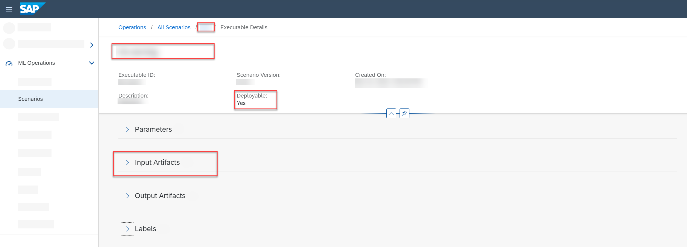

<!-- loio4a55fb3704724367a48a4b564c342ae8 -->

# Serving Executables

An executable that is used to deploy \(serve\) an AI model is called a serving executable.

Like any other executable, a serving executable contains placeholders for input artifacts \(usually models\), parameters \(hyperparameters for the model\) and output artifacts \(although rarely used with serving executables\). The values for these placeholders are provided by creating a configuration. You use the serving executable and configuration to create a deployment for online predictions.

> ### Example:  
> In SAP AI Core, a serving executable can be a template. For more information, see [Serving Template](https://help.sap.com/viewer/2d6c5984063c40a59eda62f4a9135bee/LATEST/en-US/20a8667ef19e4de59a4469cb542a7457.html).

The following is an example of a serving executable.

-   The scenario name is included in the menu path.
-   The executable name, executable ID, description, and version are displayed in the header.

-   The *Deployable* field indicates whether the executable is intended for training or serving purposes. A `Yes` value indicates that the executable is intended for deployment \(serving\).

-   The *Input Artifacts* section contains the dataset.

Workflow steps:

1.  Create a configuration to combine a model \(artifact\) with a placeholder \(input artifact\), and set values \(integer, string or float\) for the parameter placeholders of the serving executable.
2.  Start the deployment \(serving\) process by choosing *Create Deployment* on the configuration details screen.
3.  Upon completion of a deployment, an endpoint is generated. The endpoint can be used in real-time for your AI use case.

> ### Note:  
> Since SAP AI Launchpad is an interface to your AI runtime instance, the serving executable is also present in your AI runtime.

**Related Information**  

[Deployments](deployments-0543c2c.md "A deployment runs a model for serving (inferencing) purposes. You use deployments to make online predictions.")

