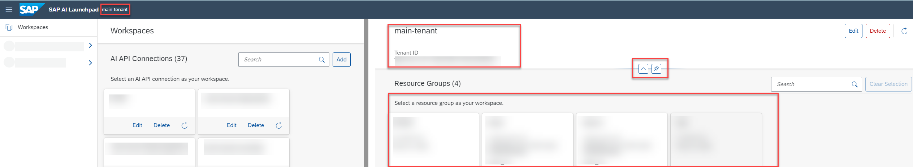

<!-- loio0c077289f29d4147921fb07ab0f68b7f -->

<link rel="stylesheet" type="text/css" href="css/sap-icons.css"/>

# Set Resource Group

You select a connection and resource group so that you can complete tasks within the *ML Operations* app.

<a name="loio0c077289f29d4147921fb07ab0f68b7f__prereq_jxh_cq2_rpb"/>

## Prerequisites

-   You have the `connections_viewer` role. For more information, see [Roles and Authorizations](roles-and-authorizations-4ef8499.md).

-   You have created one or more AI API connections \(see [Add Connection to SAP AI Core](add-connection-to-sap-ai-core-71dfe2c.md)\).

<a name="loio0c077289f29d4147921fb07ab0f68b7f__context_sdd_5gs_h5b"/>

## Context

A connection links SAP AI Launchpad via the AI API to a specific instance of an AI runtime, for example, SAP AI Core.

Resource groups represent a virtual collection of related resources within the scope of your AI runtime. Resource groups are used to isolate related ML resources and workloads for logical and performance reasons. Administrators can create, edit, or delete resource groups using the *ML Operations* app.

By default, your users can access all resource groups. If required, you can define custom settings to connections and resource groups. Custom settings define user access at both connection and resource group level. Applying custom settings means that users only see connections and resource groups which are applicable to their needs.

**Related Information**  

[Custom Access for Connections](custom-access-for-connections-8ba6a92.md "You can selectively control users' access to conections within SAP AI Launchpad.")

[Custom Access for Resource Groups](custom-access-for-resource-groups-19e3932.md "You can selectively control users' access to resource groups (within an AI runtime connection) in SAP AI Launchpad.")

[Manage Resource Groups](manage-resource-groups-7217afb.md "")

[Resource Groups](https://help.sap.com/viewer/2d6c5984063c40a59eda62f4a9135bee/CLOUD/en-US/26c6c6b50e3f412f8bc0cd6a8ebdb850.html "SAP AI Core tenants use resource groups to isolate related ML resources and workloads. Scenarios, executables, and Docker registry secrets are shared across all resource groups.") :arrow_upper_right:

<a name="loioa0204f94a94e4407abf772e76104d834"/>

<!-- loioa0204f94a94e4407abf772e76104d834 -->

## Assign Connection to Workspace

<a name="loioa0204f94a94e4407abf772e76104d834__context_i5y_3gs_h5b"/>

## Context

A workspace provides users with connections to AI runtimes, such as SAP AI Core.

<a name="loioa0204f94a94e4407abf772e76104d834__steps_lyh_xhv_xqb"/>

## Procedure

1.  In the *Workspaces* app, find the connection.

    Each connection appears as a tile. You can search the connections by entering the name or part of the name in the :mag: field.

2.  Select the required connection.

    The name of the selected connection appears in the SAP AI Launchpad header, and in the pane header for the resource groups. For reference, the tenant ID is displayed. You can collapse or pin the header.

    

<a name="loioa0204f94a94e4407abf772e76104d834__result_tkh_jyw_qtb"/>

## Results

With the connection assigned, you can now choose a resource group. See [Assign Resource Group to Workspace](set-resource-group-0c07728.md#loio1fe43ac042ab46749bec34b50601dce0).

**Related Information**  

[Custom Access for Connections](custom-access-for-connections-8ba6a92.md "You can selectively control users' access to conections within SAP AI Launchpad.")

<a name="loio1fe43ac042ab46749bec34b50601dce0"/>

<!-- loio1fe43ac042ab46749bec34b50601dce0 -->

## Assign Resource Group to Workspace

<a name="loio1fe43ac042ab46749bec34b50601dce0__prereq_m4h_x4t_rrb"/>

## Prerequisites

You have the `allow_all_resourcegroups` role, or you are assigned a role collection that contains it.

<a name="loio1fe43ac042ab46749bec34b50601dce0__context_vw1_4yp_j5b"/>

## Context

Resource groups are used to isolate related ML resources and workloads for logical and performance reasons.

By default, users can access all resource groups. However, custom access settings may apply so that users only see connections and resource groups applicable to their needs. See [Custom Access for Resource Groups](custom-access-for-resource-groups-19e3932.md).

Administrators can create, edit, or delete resource groups using the *ML Operations* app.

<a name="loio1fe43ac042ab46749bec34b50601dce0__steps_g1d_cqk_wqb"/>

## Procedure

1.  Assign the connection to your workspace from the AI API connections list. See [Assign Connection to Workspace](set-resource-group-0c07728.md#loioa0204f94a94e4407abf772e76104d834).

    Each resource group appears as a tile in the right pane. You can search the resource groups by entering the resource ID or part of the ID in the :mag: field.

    Resource groups are listed by resource ID, and with identifying details such as subaccount ID, zone ID, instance ID, and created on timestamp.

2.  **Optional:** Check the labels for the resource group by choosing  \(Labels\). The *Labels* dialog appears showing all labels for the selected resource group. Labels include subaccount ID, zone ID, instance ID, as well as any other defined labels. Labels are subject to character limitations, and you can mouseover a label for its complete details.

3.  Find the resource group and select it for your workspace. The ID of the selected resource group appears next to the connection name in the header.

    > ### Tip:  
    > If you can't find the required resource group, contact your administrator.

<a name="loio1fe43ac042ab46749bec34b50601dce0__result_ngb_ccx_qtb"/>

## Results

The *ML Operations* app and its functions are now available in the navigation pane.

**Related Information**  

[Create a Resource Group](create-a-resource-group-060d9be.md "As an administrator, you create resource groups to isolate your ML workloads and processes.")

[Resource Groups](https://help.sap.com/viewer/2d6c5984063c40a59eda62f4a9135bee/CLOUD/en-US/26c6c6b50e3f412f8bc0cd6a8ebdb850.html "SAP AI Core tenants use resource groups to isolate related ML resources and workloads. Scenarios, executables, and Docker registry secrets are shared across all resource groups.") :arrow_upper_right:

