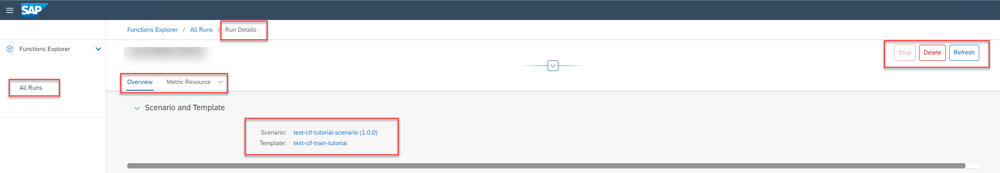

<!-- loioa68bde61850f45e2a8cc2034f1a5157a -->

# Stop a Run

You can stop a run \(training process\) and release any computing resource acquired the run.

<a name="loioa68bde61850f45e2a8cc2034f1a5157a__prereq_b54_nld_jpb"/>

## Prerequisites

You have the role `scenario_job_editor`, or you are assigned to a role collection that contains this role. For more information, see [Roles and Authorizations](security-e4cf710.md#loio4ef8499d7a4945ec854e3b4590830bcc).

## Context

You can only stop a run if it has a *Running* or *Pending* status, which means that computing resources have been allocated to the run. For runs in other statuses, the *Stop* button is not enabled.

## Procedure

1.  Find the run and display its details. For more information, see [Investigate a Run](investigate-a-run-e479244.md).

2.  Choose *Stop* in the run's header.

    

3.  In the warning dialog, choose *Stop* to confirm the stop.

<a name="loioa68bde61850f45e2a8cc2034f1a5157a__result_rr1_4nd_jpb"/>

## Results

After a run is stopped, the status of the run changes, and any computing resources are released.

