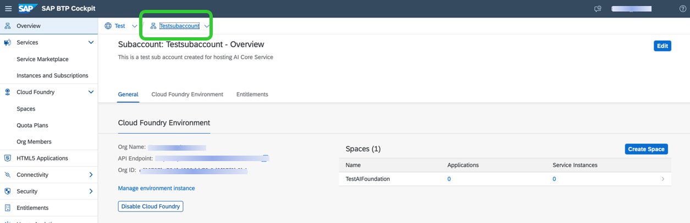

<!-- loio30eea895590f4f7ab181817f2f298066 -->

# Subscribe to SAP AI Launchpad

You subscribe to SAP AI Launchpad from the Service Marketplace in the SAP BTP cockpit.

## Procedure

1.  In the SAP BTP cockpit, choose *Account Explorer*.

2.  Go to your global account and choose your subaccount.

    

3.  Choose *Service Marketplace* and click the tile for SAP AI Launchpad.

    

4.  Click *Create* to subscribe to SAP AI Launchpad.

    

5.  Choose *Instances and Subscriptions* to see the created instances. The SAP AI Launchpad application appears with the status *Subscribed*.

    

