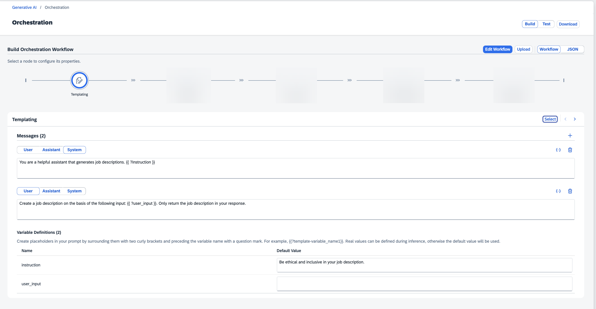

<!-- loio11d44e657b5946f6880729da08eba0da -->

<link rel="stylesheet" type="text/css" href="css/sap-icons.css"/>

# Templating

In this section, you enter your prompt to be passed to the generative AI model. You can also enter system messages to specify how the model is to answer a question. You can specify the role that the message is for, and you can provide sample queries and responses for the model.

When you enter the prompt and the system message, you can define placeholders by surrounding the text with two curly brackets and preceding the placeholder name with a question mark. For example, Create a job description for the role of `{{?job_role1}}`. The names of your placeholders must meet the following criteria:

-   Start with a letter

-   End with a letter or a number

-   Do not include special characters other than an underscore \(\_\) or a hyphen \(-\). Note that consecutive underscores or hyphens are not permitted.

For each placeholder, you can enter a default value that is used to test your model. If you do not specify a default value, you will be prompted to enter a value when you test the workflow.

You can add more message blocks using the :heavy_plus_sign:.

For selected models, image inputs are supported, and can be added using the  \(add image\)icon or copy and paste. Prompt messages are limited to 5.00mb across all inputs.

You can check which models support image input in the *Model Library*, or you can choose your model configuration through the catalog view. For more information, see [Model Library](model-library-fce6fea.md) and [Model Configuration](model-configuration-be3cd61.md).

If you include an image in your template, and then configure a model that does not support images in your model configuration, your orchestration workflow will result in an error.

You can use prompts saved in your prompt registry by clicking *Select* and choosing a template. For more information, see [Prompt Registry in SAP AI Core](https://help.sap.com/docs/AI_CORE/52b4adb30e6744709d6226d2b0659dea/5392e7dbbdef4011ab511f33416aa8b1.html).

