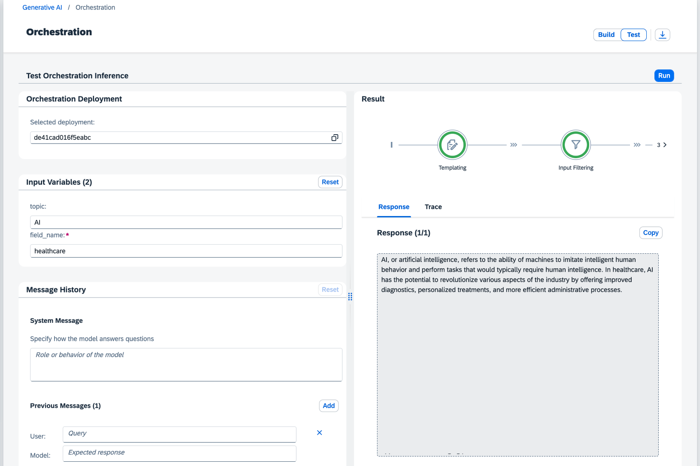

<!-- loio5b0183d69a7a4d85acc0db7fb65fa51e -->

<link rel="stylesheet" type="text/css" href="css/sap-icons.css"/>

# Test Your Orchestration Workflow

After you have built your orchestration workflow, you can test it to generate output from your chosen model.

## Procedure

1.  Change the mode from *Build* to *Test*.

2.  Check the orchestration deployment and change it if necessary.

3.  If you have included placeholders in the template, enter the values that you want to be passed to the model.

4.  **Optional:** As the context, give the model additional instructions to further refine the output. You can also provide sample queries and responses here.

5.  Choose *Run*.

<a name="loio5b0183d69a7a4d85acc0db7fb65fa51e__result_zmf_qbq_ybc"/>

## Results

SAP AI Launchpad displays the response to your prompt, which you can copy to the clipboard. You can also examine the trace to see the JSON for a particular response. The JSON shows the trace for the orchestration workflow that you designed.

If you want to download the JSON, you can do so by clicking .

