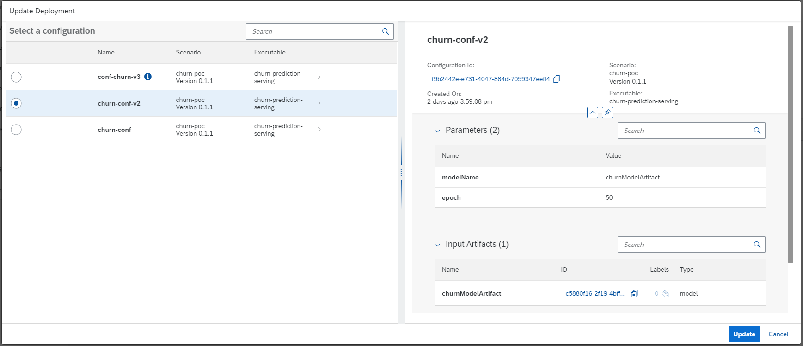
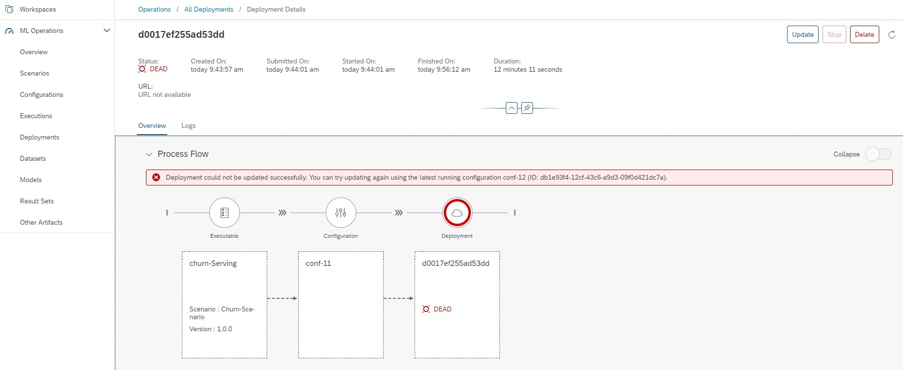

<!-- loiobce2b163171b416d9cca0de55b7cc507 -->

# Update a Deployment

You can update a deployment with your choice of configuration.

<a name="loiobce2b163171b416d9cca0de55b7cc507__prereq_amz_nmb_wxb"/>

## Prerequisites

You have the `mloperations_editor` role, or you are assigned a role collection that contains this role. For more information, see [Roles and Authorizations](https://help.sap.com/docs/ai-launchpad/sap-ai-launchpad/roles-and-authorizations).

<a name="loiobce2b163171b416d9cca0de55b7cc507__context_sm2_4mb_wxb"/>

## Context

Multiple configurations can be associated with a deployment. However, a deployment can only use one configuration. When you update a deployment, you can choose to apply a new configuration, or re-use an older or previously used configuration. For example:

-   Your existing deployment serves models A and B, but now you'd like to replace model A with a new model C. You want to use the same deployment and perform inference using the existing deployment URL endpoint.

-   You want to update an existing deployment with new parameter bindings, such as number of replicas, autoscaling annotation, or ENV variables.

Deployments can only be updated if their status is *pending*, *running* or *dead*.

For deployments subject to a duration, there is no impact on duration when updating the deployment. The deployment will run with the updated configuration until the specified date and time.

The updated deployment retains the inference URL. If you use a new deployment configuration, inference requests continue to work.

<a name="loiobce2b163171b416d9cca0de55b7cc507__steps_dlk_4mb_wxb"/>

## Procedure

1.  Navigate to the deployment's details. See [View a Deployment](https://help.sap.com/docs/AI_LAUNCHPAD/92d77f26188e4582897b9106b9cb72e0/d6f793e11145488daac3d1b7229a052a.html).

2.  Choose *Update*. The *Update Deployment* dialog box appears listing all available configurations. You can display summary details for each configuration, and use this information to compare details such as parameters and input artifacts.

    

3.  Select the required configuration from the list, and choose *Update* to update the deployment.

    > ### Tip:  
    > The system shows the configuration which is already in use. You can't update the deployment with this configuration.

4.  Check the *Overview* tab of the *Deployment Details* page, and confirm that the deployment is *running* with the selected configuration.

    > ### Note:  
    > If the update was not effective and the deployment status is *dead*, you'll receive an error message. The error message contains the configuration ID of the last configuration that resulted in a *running* deployment. You can update the deployment with this last configuration to undo or rollback the error, and return the deployment to a *running* status.

    

**Related Information**  

[Update a Deployment](https://help.sap.com/viewer/2d6c5984063c40a59eda62f4a9135bee/CLOUD/en-US/9789ddda860e4056b12efa892e6e4e1b.html "") :arrow_upper_right:

