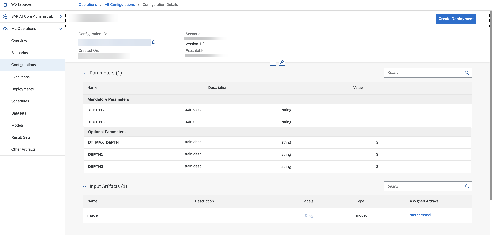

<!-- loiod3de4a46dd7c4538a5f9a4486efcd52e -->

<link rel="stylesheet" type="text/css" href="css/sap-icons.css"/>

# View a Configuration

A configuration consists of parameters and input artifact references for training or deployment processes.

<a name="loiod3de4a46dd7c4538a5f9a4486efcd52e__prereq_fkt_wpm_1yb"/>

## Prerequisites

You have either the `mloperations_viewer` or `scenario_configuration_viewer` role, or you are assigned a role collection that contains one of these roles. For more information, see [Roles and Authorizations](https://help.sap.com/docs/ai-launchpad/sap-ai-launchpad/roles-and-authorizations).

<a name="loiod3de4a46dd7c4538a5f9a4486efcd52e__steps_u4y_wpm_1yb"/>

## Procedure

1.  Choose the resource group. For more information, see [Set Resource Group](https://help.sap.com/docs/AI_LAUNCHPAD/92d77f26188e4582897b9106b9cb72e0/0c077289f29d4147921fb07ab0f68b7f.html). Note that configurations are not shared across resource groups.

2.  In the *ML Operations* app, choose *Configurations*.

    The *Configurations* screen appears listing all of the configurations for the selected resource group. The columns include the following information:

    -   *Name / ID*: name and ID of the configuration
    -   *Scenario*: name of the scenario which uses the configuration
    -   *Executable*: name of the executable \(template\) used in the configuration
    -   *Created on*: timestamp indicating when the configuration was created
    -   *Parameters* and *Input Artifacts*: number of parameters \(alphanumeric values\) and input artifacts \(dataset or model\) used by the configuration

3.  **Optional:** Search the list by entering a configuration name or part of the name in the :mag: field.

    > ### Tip:  
    > When your runtime is SAP AI Core, this search is not case-sensitive. For other runtimes, search may be case-sensitive.

4.  **Optional:** Filter the list by choosing  \(Filter\). The *Filter* dialog appears.

    1.  Enter a configuration ID. A valid configuration ID consists of lowercase characters, hyphens \(-\), and numbers.

    2.  Alternatively, select a scenario and further choose attributes, such as version and executable.

    3.  Choose *Apply* to apply the filter and conditions to the list.

5.  To view the details for a configuration, select a configuration in the list or choose  \(More\). The *Configuration Details* screen appears. The overview shows a summary of the configuration.

    

6.  **Optional:** Create either an execution or deployment using the configuration.

    1.  When a configuration is used for training, choose *Create Execution* to initiate the training process.

    2.  When a configuration is used for deploying a model, choose *Create Deployment* to deploy the model.

7.  **Optional:** Choose an artifact to redirect to a list of artifacts, prefiltered based on attributed of the chosen artifact.

**Related Information**  

[Create a Deployment](create-a-deployment-33b34e9.md "You create a deployment to run a model for serving purposes.")

[Create an Execution](create-an-execution-6c90fc7.md "")

