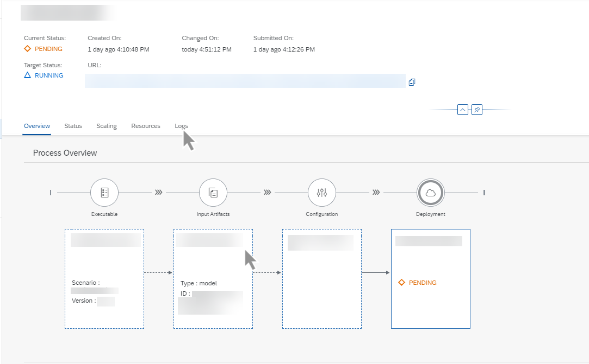
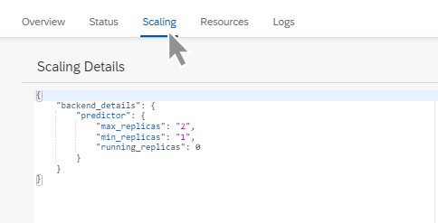
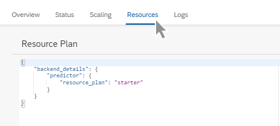

<!-- loiod6f793e11145488daac3d1b7229a052a -->

<link rel="stylesheet" type="text/css" href="css/sap-icons.css"/>

# View a Deployment

You can view the lifecycle details for a deployment, and explore details for each operation in the deployment.

<a name="loiod6f793e11145488daac3d1b7229a052a__prereq_tv4_c4b_wxb"/>

## Prerequisites

You have the `mloperations_viewer` or `scenario_deployment_viewer` role, or you are assigned a role collection that contains one of these roles. For more information, see [Roles and Authorizations](https://help.sap.com/docs/ai-launchpad/sap-ai-launchpad/roles-and-authorizations).

<a name="loiod6f793e11145488daac3d1b7229a052a__steps_y33_d4b_wxb"/>

## Procedure

1.  Choose a resource group. For more information, see [Set Resource Group](https://help.sap.com/docs/AI_LAUNCHPAD/92d77f26188e4582897b9106b9cb72e0/0c077289f29d4147921fb07ab0f68b7f.html).

2.  In the *ML Operations* app, choose *Deployments*.

    The *All Deployments* screen appears listing all of the deployments for the selected resource group. Deployments are listed by ID, and with additional details such as configuration name and ID, current and target status, created on timestamp, and changed on timestamp.

    > ### Note:  
    > If your runtime supports deployment durations, you'll see running until dates. Deployments run until this time, and are then automatically stopped and deleted.

3.  **Optional:** Filter the list by choosing  \(Filter\). The *Filter* dialog appears.

    1.  Enter a deployment ID, if required. A valid deployment ID consists of lowercase characters, hyphens \(-\), and numbers.

    2.  Alternatively, enter a configuration ID or status, or choose a scenario and additional attributes, such as version and executable.

    3.  Choose *Apply* to apply the filter and conditions to the list.

4.  To view the details for an individual deployment, select the deployment in the list or choose  \(More\).

    You'll see an overview of the deployment lifecycle process.

    

    > ### Tip:  
    > Timestamp details for each step in the deployment process can be seen in the header. These dates and times show when the deployment was created, submitted, started, and finished. The process duration is also displayed. Timestamps are displayed in the user's local time zone.
    > 
    > If your runtime supports deployment durations, you'll see a running until date. If a deployment is not complete by this time it will be automatically stopped and deleted.
    > 
    > The *URL* is the endpoint used to make predictions.
    > 
    > The *Overview* tab shows the operations involved in the deployment, as well as summary data, such as ID. You can click each card in the process overview to display the specific operation in more detail.

5.  **Optional:** Choose the *Status* tab to check detailed message, status, and severity information for the deployment. See [View Status Details](https://help.sap.com/docs/AI_LAUNCHPAD/92d77f26188e4582897b9106b9cb72e0/75b90def0e91434ebce276ab29f99cd9.html).

6.  **Optional:** When your runtime is SAP AI Core, you can choose the *Scaling* tab to check the replica limits, and the number of running replicas for the deployment.

    

    > ### Tip:  
    > A running deployment on a given node is called a replica. Replicas are used in distributed model training. For performance reasons, there are limits on the number of running replicas. You check how many replicas are running for a model deployment to better understand performance.

7.  **Optional:** When your runtime is SAP AI Core, you can choose the *Resources* tab to check what resource plan applies to the deployment.

    

    > ### Tip:  
    > A resource plan is a preconfigured infrastructure bundle that is used to process an AI operation, such as a deployment. Different operations within an AI workflow can use different resource plans.

8.  **Optional:** Choose the *Logs* tab to check or download the logs for the deployment. See [View Deployment Logs](https://help.sap.com/docs/AI_LAUNCHPAD/92d77f26188e4582897b9106b9cb72e0/4f9682e48a54430e870d525f1cfd312b.html) .

**Related Information**  

[Update a Deployment](update-a-deployment-bce2b16.md "You can update a deployment with your choice of configuration.")

