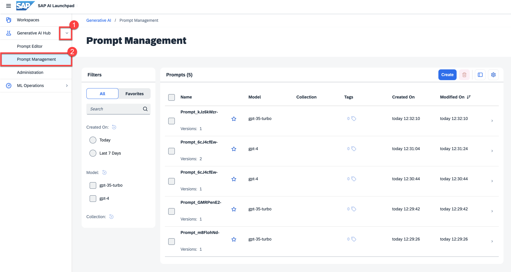

<!-- loiod07a272b22234d7a920f942a3d280c51 -->

# View a Saved Prompt

<a name="loiod07a272b22234d7a920f942a3d280c51__prereq_yxf_gyb_rzb"/>

## Prerequisites

You have either the `genai_manager` or `prompt_manager` role, or you are assigned a role collection that contains one of these roles. For more information, see [Roles and Authorizations](roles-and-authorizations-4ef8499.md).

> ### Note:  
> Prompts are saved in one region only and can only be retrieved or deleted by an instance of AI launchpad in that region.

<a name="loiod07a272b22234d7a920f942a3d280c51__steps_zr4_pq5_jzb"/>

## Procedure

1.  Select the connection to your SAP AI Core runtime in the *Workspaces* app and choose the resource group that was used for your *Generative AI Hub* deployment.

2.  In the *Workspaces* app, expand the *Generative AI Hub* and choose *Prompt Management*.

    

    Your prompts will be listed. Use the filters to navigate to your desired prompt.

3.  **Optional:** You can

    -   Mark a prompt as favorite using the star button.

    -   See the prompt details by selecting the prompt entry.

    -   See version details by selecting the version entry from the prompt details.

