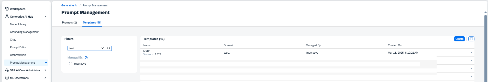

<!-- loiocfe6c8bbe7c14a3a9128f6c8bafd7679 -->

# View a Saved Template

<a name="loiocfe6c8bbe7c14a3a9128f6c8bafd7679__prereq_yxf_gyb_rzb"/>

## Prerequisites

You have either the `genai_manager` or `prompt_manager` role, or you are assigned a role collection that contains one of these roles. For more information, see [Roles and Authorizations](security-e4cf710.md#loio4ef8499d7a4945ec854e3b4590830bcc).

> ### Note:  
> Prompts are saved in one region only and can only be retrieved or deleted by an instance of AI launchpad in that region.

<a name="loiocfe6c8bbe7c14a3a9128f6c8bafd7679__steps_zr4_pq5_jzb"/>

## Procedure

1.  Select the connection to your SAP AI Core runtime in the *Workspaces* app and choose the resource group that was used for your *Generative AI Hub* deployment.

2.  In the *Workspaces* app, expand the *Generative AI Hub* and choose *Prompt Management*. Select the *Templates* tab.

    

    Your templates will be listed. Use the filters to navigate to your desired template.

3.  **Optional:** You can

    -   See the template details by selecting the template entry.

    -   See revision details by selecting the revision entry from the template details.

<a name="loiocfe6c8bbe7c14a3a9128f6c8bafd7679__postreq_ugy_jdz_r2c"/>

## Next Steps

Make changes to the prompt by selecting *Open in Prompt Editor*.

