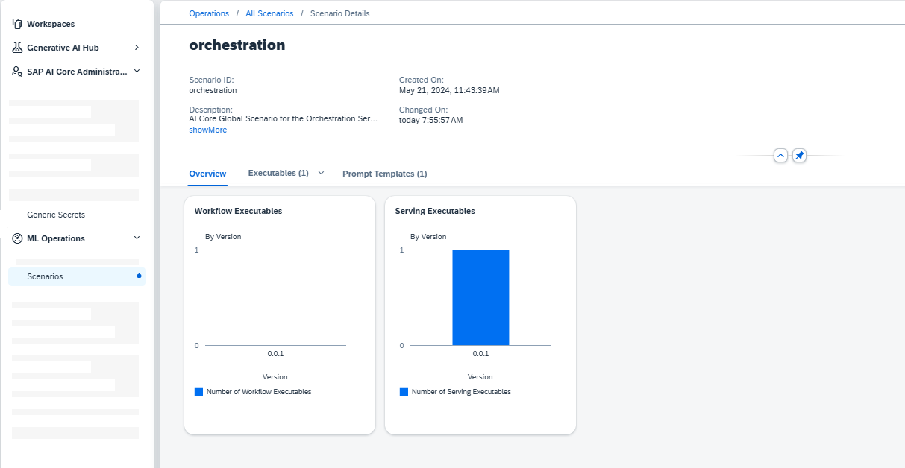

<!-- loio6ef1b9ad4ff446cab200b05d2f5a0600 -->

<link rel="stylesheet" type="text/css" href="css/sap-icons.css"/>

# View a Scenario

You use the *ML Operations* app to list all scenarios for a selected connection.

<a name="loio6ef1b9ad4ff446cab200b05d2f5a0600__prereq_glq_wd3_wxb"/>

## Prerequisites

You have either the `mloperations_viewer` or `scenario_metadata_viewer` role, or you are assigned a role collection that contains one of these roles. For more information, see [Roles and Authorizations](https://help.sap.com/docs/ai-launchpad/sap-ai-launchpad/roles-and-authorizations).

<a name="loio6ef1b9ad4ff446cab200b05d2f5a0600__steps_jcx_wd3_wxb"/>

## Procedure

1.  Select an AI API connection \(setting resource group is not required\). For more information, see [Set Resource Group](https://help.sap.com/docs/AI_LAUNCHPAD/92d77f26188e4582897b9106b9cb72e0/0c077289f29d4147921fb07ab0f68b7f.html).

2.  Choose the *Scenarios* tile on the *Overview* dashboard, or in the *ML Operations* app, choose *Scenarios*.

    The *Scenarios* screen appears listing all of the scenarios for the selected connection. Scenarios are listed by name, and with additional details such as description, created on timestamp, changed on timestamp, number of contained executables, and number of versions.

3.  To view the details for a scenario, select a scenario in the list or choose  \(More\). The *Scenario Details* screen appears with the *Overview* tab displayed. The overview shows a graphical summary of the scenario, showing the distribution of workflow executables and serving executables by scenario version.

4.  **Optional:** To view your executables. choose the *Executables* tab to list the workflow and serving executables for the scenario across its various versions.

    -   Filter the list by choosing a version in the *Show* field, or show all versions.

    -   Search the list by entering a name, partial name, or part of the description in the :mag: field.
    -   Display the details for an executable by selecting an executable in the list, or choosing  \(More\).

5.  **Optional:** To view your prompt templates, choose the *Prompt Templates* tab.

    -   Filter your prompt template using the filter field.
    -   Choose a prompt template to see its detailed view.

    

**Related Information**  

[Workflow Executables](workflow-executables-799bb31.md "An executable that is used to train an AI model or perform batch inferencing is called a workflow executable.")

[Serving Executables](serving-executables-4a55fb3.md "An executable that is used to deploy (serve) an AI model is called a serving executable.")

