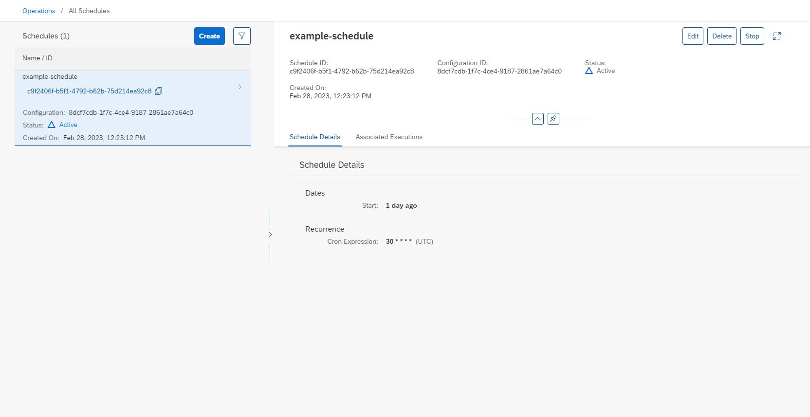

<!-- loio18570047e4df4bda8074e053a706fd0a -->

<link rel="stylesheet" type="text/css" href="css/sap-icons.css"/>

# View a Schedule

<a name="loio18570047e4df4bda8074e053a706fd0a__prereq_nv2_wwp_kwb"/>

## Prerequisites

You have the `mloperations_viewer` or `execution_schedules_viewer` role, or you have been assigned a role collection that contains one of these roles. For more information, see [Roles and Authorizations](roles-and-authorizations-4ef8499.md).

## Procedure

1.  Choose a resource group. For more information, see [Set Resource Group](set-resource-group-0c07728.md#loio0c077289f29d4147921fb07ab0f68b7f).

2.  In the *ML Operations* app, choose *Schedules*.

    The *Schedules* screen appears listing all of the schedules for the selected resource group. Schedules are listed by name/ID, with additional details such as Configuration ID, Status, and Created On timestamp. Details for the selected schedule are displayed on the right.

3.  Filter the list by choosing  \(Filter\). The *Filter* dialog appears. Enter at least one of the following:

    -   Schedule ID: A valid schedule ID consists of lowercase characters, hyphens \(-\), and numbers
    -   Configuration ID
    -   Status

    Choose *Apply* to apply the filter and conditions to the list.

4.  When a schedule is selected, you can see the details of the selected schedule in the adjacent panel.

    -   For **One-time** schedules, the *Schedule Details* tab shows the creation time stamp.
    -   For **Recurring** schedules, the *Schedule Details* tab shows the cron expression with the start and end time of the schedule.

        > ### Note:  
        > The cron expression entered is in UTC time.

    

5.  Choose the *Associated Executions* tab to view the executions created by the schedule. For more information, see [View Associated Executions](view-associated-executions-c7c2307.md)

