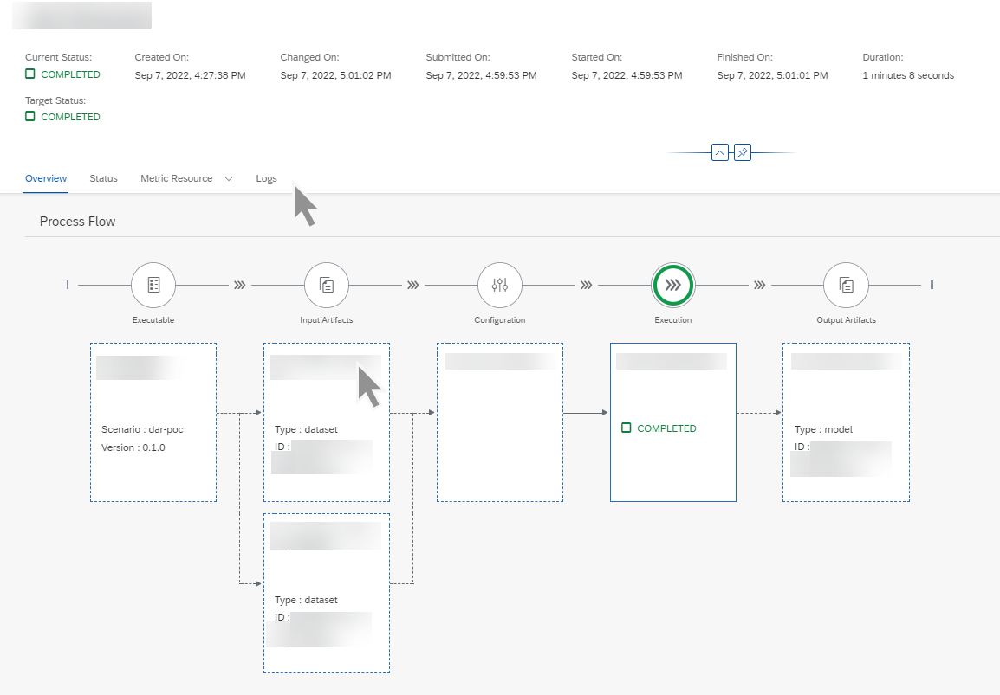

<!-- loio33bae6da5df340d892828b2c673efaea -->

<link rel="stylesheet" type="text/css" href="css/sap-icons.css"/>

# View an Execution

You can view the details for an execution, and investigate details for each operation in the lifecycle process. You can use the overview like a dashboard to explore an execution's operations.

<a name="loio33bae6da5df340d892828b2c673efaea__prereq_ycf_b23_wxb"/>

## Prerequisites

You have either the `mloperations_viewer` or `scenario_execution_viewer` role, or you are assigned a role collection that contains one of these roles. For more information, see [Roles and Authorizations](https://help.sap.com/docs/ai-launchpad/sap-ai-launchpad/roles-and-authorizations).

<a name="loio33bae6da5df340d892828b2c673efaea__steps_zbl_b23_wxb"/>

## Procedure

1.  Choose a resource group. For more information, see [Set Resource Group](https://help.sap.com/docs/AI_LAUNCHPAD/92d77f26188e4582897b9106b9cb72e0/0c077289f29d4147921fb07ab0f68b7f.html).

2.  In the *ML Operations* app, choose *Executions*.

    The *Executions* screen appears listing all of the executions for the selected resource group. Executions are listed by ID, and with additional details such as configuration name and ID, current and target status, created on timestamp, and changed on timestamp.

3.  **Optional:** Filter the list by choosing  \(Filter\). The *Filter* dialog appears.

    1.  Enter an execution ID, if required. A valid execution ID consists of lowercase characters, hyphens \(-\), and numbers.

    2.  Alternatively, enter a configuration ID or status, or choose a scenario and additional attributes, such as version and executable.

    3.  Choose *Apply* to apply the filter and conditions to the list.

4.  To view the details for an execution, select an execution in the list or choose  \(More\).

    You'll see an overview of the execution, including the overview steps, and tabs with more information.

    

    > ### Tip:  
    > Timestamp details for each step in the execution process can be seen in the header. These dates and times show when the execution was created or changed. Timestamps are displayed in the user's local time zone.
    > 
    > The *Overview* tab shows the operations involved in the execution, as well as summary data, such as input dataset and output model \(training\) or result set \(inferencing\). You can click each card in the process to display the specific operation in more detail.

5.  **Optional:** Choose the *Status* tab to check detailed message, status, and severity information for the execution. See [View Status Details](https://help.sap.com/docs/AI_LAUNCHPAD/92d77f26188e4582897b9106b9cb72e0/7bda8db1dcb045a29c84c76e78a3b814.html).

6.  **Optional:** Choose the *Metric Resource* tab to check the metrics and custom information for the execution. See [View the Metric Resource for an Execution](https://help.sap.com/docs/AI_LAUNCHPAD/92d77f26188e4582897b9106b9cb72e0/7bda8db1dcb045a29c84c76e78a3b814.html).

7.  **Optional:** Choose the *Logs* tab to check or download the logs for the execution. See [View Execution Logs](https://help.sap.com/docs/AI_LAUNCHPAD/92d77f26188e4582897b9106b9cb72e0/afec746903f24c15ac60f6fe473d64f7.html).

**Related Information**  

[Compare Executions](compare-executions-9b75f67.md "You can compare executions to determine which configuration parameters result in optimum results.")

[List Executables](https://help.sap.com/viewer/2d6c5984063c40a59eda62f4a9135bee/CLOUD/en-US/80895a495b4a466b8976735995e23753.html "") :arrow_upper_right:

