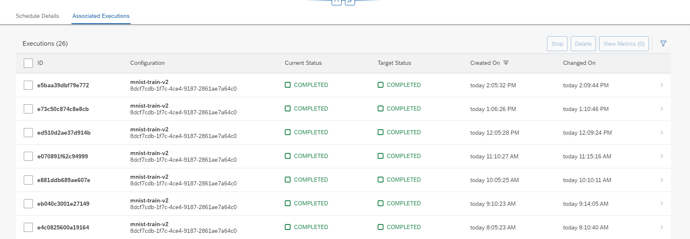

<!-- loioc7c2307191b04970957e97ffbf5f83f2 -->

# View Associated Executions

<a name="loioc7c2307191b04970957e97ffbf5f83f2__prereq_tpk_ycq_kwb"/>

## Prerequisites

You have the `mloperations_editor` or `execution_schedules_editor role`, or you have been assigned a role collection that contains one of these roles. For more information, see [Roles and Authorizations](roles-and-authorizations-4ef8499.md).

## Context

Executions created by this schedule are shown in the *Associated Executions* tab.

## Procedure

1.  Navigate to the Schedule's details. For more information, see [View a Schedule](view-a-schedule-1857004.md).

2.  Choose the *Associated Executions* tab to view the executions created by this schedule.

    

