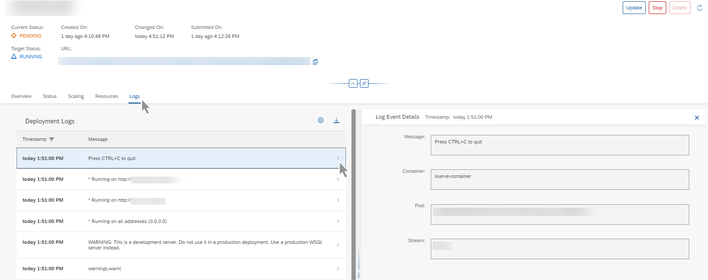

<!-- loio4f9682e48a54430e870d525f1cfd312b -->

<link rel="stylesheet" type="text/css" href="css/sap-icons.css"/>

# View Deployment Logs

Deployment logs are generated by the code \(in the AI pipeline template\) which is deploying the model.

<a name="loio4f9682e48a54430e870d525f1cfd312b__context_zfz_ysb_wxb"/>

## Context

Deployment logs differ from deployment status logs \([View Status Details](https://help.sap.com/docs/AI_LAUNCHPAD/92d77f26188e4582897b9106b9cb72e0/75b90def0e91434ebce276ab29f99cd9.html)\).

-   Status logs show information **about** the computing resources and components \(models and AI pipeline template\)
-   Deployment logs show information **from** the computing resources and components

<a name="loio4f9682e48a54430e870d525f1cfd312b__steps_yg2_zsb_wxb"/>

## Procedure

1.  Navigate to the deployment's details screen. See [View a Deployment](https://help.sap.com/docs/AI_LAUNCHPAD/92d77f26188e4582897b9106b9cb72e0/d6f793e11145488daac3d1b7229a052a.html).

2.  Choose the *Logs* tab to display log details.

    Log details include a timestamp and message. By default, logs are displayed in descending order based on timestamp.

    

3.  Choose :gear: to sort  \(Sort\)\) or filter  \(Filter\) the logs by timestamp.

4.  **Optional:** Choose  \(Download Logs\) to download the logs to your *Downloads* folder. You can download all logs or just those logs for a specified timestamp range.

5.  To view the details for an individual log, select the log in the list or choose  \(More\). The log event details are displayed in the right pane.

**Related Information**  

[Retrieve Deployment Logs](https://help.sap.com/viewer/2d6c5984063c40a59eda62f4a9135bee/CLOUD/en-US/4c86b886f6ec440b99b7284f4b17e735.html "accessed in the deployment and execution logs.") :arrow_upper_right:

