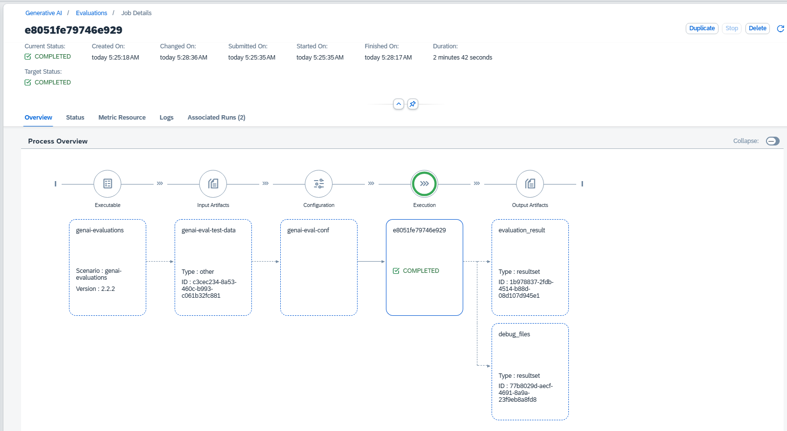

<!-- loio200ccaf6ea90467899c7904ef9984bb6 -->

<link rel="stylesheet" type="text/css" href="css/sap-icons.css"/>

# View Evaluation Job Details

<a name="loio200ccaf6ea90467899c7904ef9984bb6__prereq_vp3_r2g_s2c"/>

## Prerequisites

-   You're using the `extended` service plan. For more information, see [Service Plans](https://help.sap.com/viewer/2d6c5984063c40a59eda62f4a9135bee/CLOUD/en-US/c7244c6a7e3b4ffc928a2564c216e7c7.html "The SAP AI Core service plan you choose determines pricing, conditions of use, resources, available services, and hosts.") :arrow_upper_right:.
-   You have the `custom_evaluation`, `genai_manager` or `genai_experimenter` role, or you are assigned a role collection that contains one of these roles.

-   You have deployed an evaluation run. For more information, see [Create an Evaluation](create-an-evaluation-c15182a.md).

<a name="loio200ccaf6ea90467899c7904ef9984bb6__context_zfw_lxm_lfc"/>

## Context

Only *running* or *pending* evaluation jobs can be stopped.

You can delete an evaluation job if it has the status *Completed*, *Dead*, *Stopped*, or *Unknown*. For evaluation jobs in other statuses, the *Delete* button is not enabled.

## Procedure

1.  Select the connection to your SAP AI Core runtime in the *Workspaces* app and choose the resource group that was used for your generative AI hub deployment.

2.  In the side navigation, expand the *Generative AI Hub* and choose *Optimizations*.

3.  Navigate to the*Jobs* tab, and select the evaluation job that you want to view or choose  \(More\).

    You can filter by ID or attributes by using the  \(Filter\)icon. Your input must be an exact match.

    You'll see an overview of the evaluation job, including the overview steps, and tabs with more information.

    

    > ### Tip:  
    > Timestamp details for each step in the evaluation job process can be seen in the header. These dates and times show when the evaluation job was created or changed. Timestamps are displayed in the user's local time zone.
    > 
    > The *Overview* tab shows the operations involved in the evaluation job.

4.  **Optional:** Choose the *Status* tab to check detailed message, status, and severity information for the evaluation job.

5.  **Optional:** Choose the *Logs* tab to check or download the logs for the evaluation job.

6.  **Optional:** Choose the *Associated Runs* tab to see a list of runs associated with this evaluation job.

<a name="loio200ccaf6ea90467899c7904ef9984bb6__postreq_hjw_2ym_lfc"/>

## Next Steps

You can stop an evaluation job by choosing *Stop*.

You can delete an evaluation job by choosing *Delete*.

.

