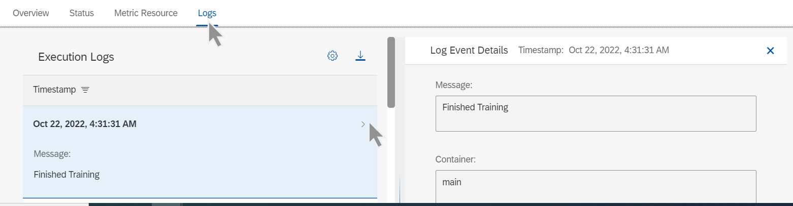

<!-- loioafec746903f24c15ac60f6fe473d64f7 -->

<link rel="stylesheet" type="text/css" href="css/sap-icons.css"/>

# View Execution Logs

You check the logs for an execution to debug an issue with a training pipeline.

<a name="loioafec746903f24c15ac60f6fe473d64f7__steps_utt_byw_tcc"/>

## Procedure

1.  Navigate to the execution's details. See [View an Execution](view-an-execution-33bae6d.md).

2.  To view the execution logs, select the *Logs* tab on the execution details page.

    Log details include a timestamp and message. By default, logs are displayed in descending order based on timestamp.

    

3.  Choose :gear: to sort  \(Sort\)\) or filter  \(Filter\) the logs by timestamp.

4.  **Optional:** Choose  \(Download Logs\) to download the logs to your *Downloads* folder. You can download all logs or just those logs for a specified timestamp range.

5.  To view the details for an individual log, select the log in the list or choose  \(More\). The log event details are displayed in the right pane.

**Related Information**  

[Retrieve Execution Logs](https://help.sap.com/viewer/2d6c5984063c40a59eda62f4a9135bee/CLOUD/en-US/fbc55d35ab7e45aab01d05509361808c.html "Deployment and execution logs contain information about API processing and metrics.") :arrow_upper_right:

