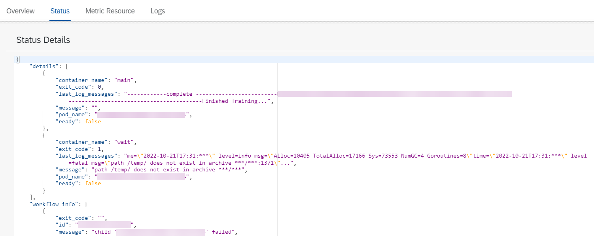

<!-- loio75b90def0e91434ebce276ab29f99cd9 -->

# View Status Details

You check the status details for an execution to see detailed code logs for a running execution. The status details include detailed status and workflow information.

<a name="loio75b90def0e91434ebce276ab29f99cd9__prereq_b53_nld_jpb"/>

## Prerequisites

You have either the `mloperations_viewer` or `scenario_execution_viewer` role, or you are assigned a role collection that contains one of these roles. For more information, see [Roles and Authorizations](roles-and-authorizations-4ef8499.md).

<a name="loio75b90def0e91434ebce276ab29f99cd9__context_hb4_wc1_2vb"/>

## Context

Once an execution is created, the status details provide information about the running execution.

## Procedure

1.  Navigate to the execution's details. See [View an Execution](view-an-execution-33bae6d.md).

2.  Choose the *Status* tab to view status details. You may need to scroll to check all status details for the execution.

    

