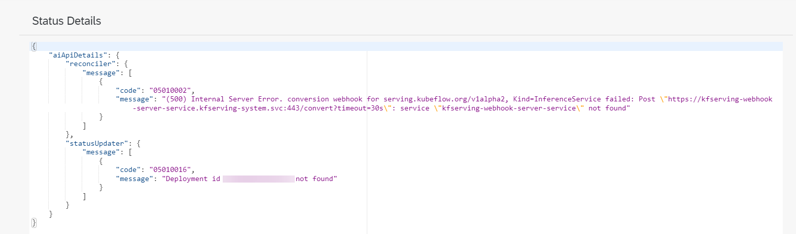

<!-- loio7bda8db1dcb045a29c84c76e78a3b814 -->

# View Status Details

You check a deployment's status details for detailed message, status, and severity information for a running deployment.

<a name="loio7bda8db1dcb045a29c84c76e78a3b814__prereq_b52_nld_jpb"/>

## Prerequisites

You have the `mloperations_viewer` or `scenario_deployment_viewer` role, or you are assigned a role collection that contains one of these roles. For more information, see [Roles and Authorizations](roles-and-authorizations-4ef8499.md).

<a name="loio7bda8db1dcb045a29c84c76e78a3b814__context_hb3_wc1_2vb"/>

## Context

Once a deployment is created, the status details provide information about a running deployment.

<a name="loio7bda8db1dcb045a29c84c76e78a3b814__steps_pvs_xsj_1rb"/>

## Procedure

1.  Navigate to the deployment's details. See [View a Deployment](view-a-deployment-d6f793e.md).

2.  Choose the *Status* tab to view status details. You may need to scroll to check all status details for the deployment.

    

