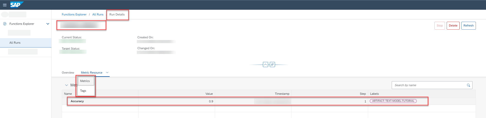

<!-- loiod4f29aaeb5154b1e9f6df2766a1e2175 -->

# View the Metric Resource for a Run

A metric is the measure of quality \(confidence\) of a model. During a run, metrics \(standard model evaluation metrics and associated labels, tags and custom info\) are logged and stored by the run template.

<a name="loiod4f29aaeb5154b1e9f6df2766a1e2175__prereq_m2f_tg3_1rb"/>

## Prerequisites

You have the `scenario_metric_viewer` role or you are assigned to a role collection that contains this role. For more information, see [Roles and Authorizations](roles-and-authorizations-4ef8499.md).

## Context

Metrics are reviewed to evaluate the quality of model generated by the run. Metrics are affected by the dataset and parameter values used by the run. A metric resource is a collection of all tracked metrics for a run. You can view a complete metric resource including labels and tags. For more information, see [Storing Metric Data](https://help.sap.com/viewer/2d6c5984063c40a59eda62f4a9135bee/CLOUD/en-US/ab04f048da444d13bae08214c9d40e12.html).

## Procedure

1.  Find the run and display its details. For more information, see [Investigate a Run](investigate-a-run-e479244.md).

2.  To view the metric resource, select the *Metric Resource* tab.

    > ### Note:  
    > The *Metric Resource* tab is only visible if the metrics capabilities extension in implemented in your AI runtime. For more information, see [API Runtime Implementations](https://help.sap.com/docs/sap-ai-core/sap-ai-core-service-guide/about-ai-api).

    

    Metric resource details are displayed, as follows:

    -   *Name*
    -   *Value*: Quality criteria \(model evaluation: Indicates a level of quality, and is dependent on the *Name* \(criteria\).
    -   *Timestamp*: Time at which the metric was logged. Time is adjusted to reflect the local timezone. For metrics that are logged multiple times, the timestamp and step can be used in conjunction to check how a metric has progressed during the run \(training process\).
    -   *Step*: Used to uniquely identify or differentiate the results. For example, a model trains iteratively on the same dataset in a single training process. Also known as an epoch.
    -   *Labels*: Custom information associated with the metric.

3.  To display the tags associated with the run, choose *Tags* from the *Metric Resource* tab options, or scroll down the screen.: Quality criteria \(model evaluation metrics\). For example, accuracy or mean absolute error \(MSE\).

**Related Information**  

[Compare Run Metrics](compare-run-metrics-0255655.md "You compare metrics for runs to determine which configuration parameters result in optimum results.")

