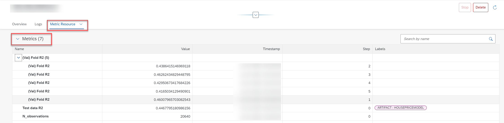
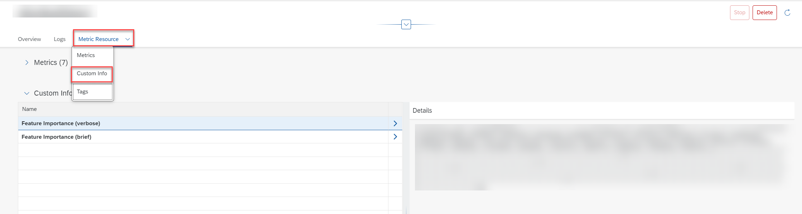
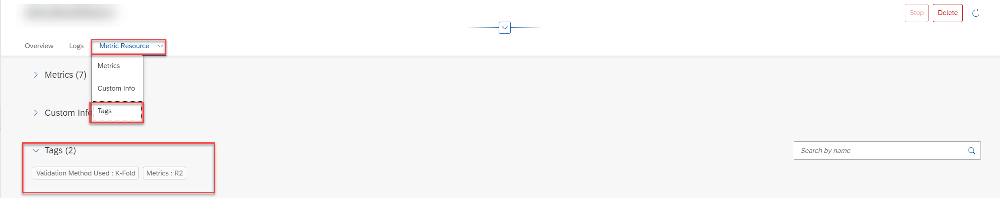

<!-- loiod85dd44d24044c7c9d66bbf0b2bbd52b -->

# View the Metric Resource for an Execution

Use metric data to determine a model's quality \(accuracy, precision, or any other custom metric value\).

## Context

Quality metrics \(associated labels, tags and custom info\) for a model are generated by the workflow executable used in the execution \(training process\). Metrics differ between executions, and depend on the input artifacts \(dataset\) and parameters specified in the configuration.

For more information about how to generate metrics during an execution, see [Storing Metric Data](https://help.sap.com/viewer/2d6c5984063c40a59eda62f4a9135bee/CLOUD/en-US/ab04f048da444d13bae08214c9d40e12.html).

## Procedure

1.  In the *ML Operations* app, find an execution and display its details. For more information, see [View an Execution](view-an-execution-33bae6d.md).

2.  To view the metrics resource data, select the *Metric Resource* tab.

    > ### Note:  
    > The *Metric Resource* tab is only visible if the metrics capabilities extension in implemented in your AI runtime. For more information, see [API Runtime Implementations](https://help.sap.com/docs/sap-ai-core/sap-ai-core-service-guide/about-ai-api).

    The metrics generated for the execution \(training process\) are displayed.

    

    Metric details are displayed, as follows:

    -   *Name*: Quality criteria, for example, accuracy or mean absolute error \(MSE\).
    -   *Value*: Indicates a level of quality, and is dependent on the *Name* \(criteria\).
    -   *Timestamp* and *Step*: Uniquely identify or differentiate the results. For metrics that are logged multiple times, the timestamp and step can be used in conjunction to check how a metric has progressed during the execution \(training process\). For example, a model trains iteratively on same dataset in a single training process. Also known as an epoch.
    -   *Labels*: Classifying phrase/ name applied to the metric for that training pipeline template \(executable\).

    > ### Note:  
    > The same data can be viewed from the details screen of the generated model, see [View Metrics for a Model](view-metrics-for-a-model-354931f.md).

3.  To display the names and key/ value pairs associated with the execution, choose *Custom Info* from the *Metric Resource* tab options, or scroll down the screen.

    

4.  To display the tags associated with the execution, choose *Tags* from the *Metric Resource* tab options, or scroll down the screen.

    

**Related Information**  

[Compare Metric Resources](compare-metric-resources-0050ba2.md "You compare metrics resources for executions to determine which configuration parameters result in optimum results.")

