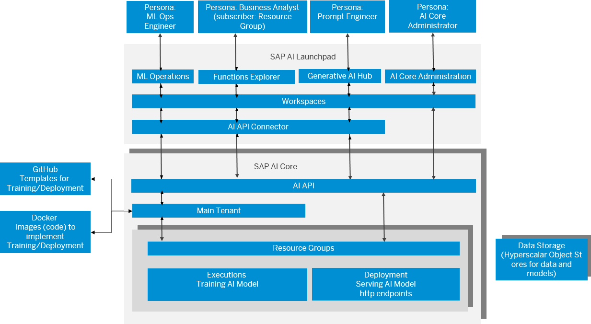

<!-- loio760889ab809841c8a8905ca492f902cb -->

# What Is SAP AI Launchpad?

Learn more about SAP AI Launchpad on SAP BTP.

SAP AI Launchpad is a multitenant software as a service \(SaaS\) application in SAP Business Technology Platform. Customers and partners can use SAP AI Launchpad to manage AI use cases \(scenarios\) across multiple instances of AI runtimes \(such as SAP AI Core\).

> ### Tip:  
> The English version of this guide is open for contributions and feedback using GitHub. This allows you to get in contact with responsible authors of SAP Help Portal pages and the development team to discuss documentation-related issues. To contribute to this guide, or to provide feedback, choose the corresponding option on SAP Help Portal:
> 
> -   *Feedback* \> *Create issue*: Provide feedback about a documentation page. This option opens an issue on GitHub.
> 
> -   *Feedback* \> *Edit page*: Contribute to a documentation page. This option opens a pull request on GitHub.
> 
> 
> You need a GitHub account to use these options.
> 
> More information:
> 
> -   [Contribution Guidelines](https://help.sap.com/docs/open-documentation-initiative/contribution-guidelines/readme.html)
> 
> -   [Introduction Video](https://www.youtube.com/watch?v=WJ0oarMlVW4)
> 
> -   [Introduction Blog Post](https://blogs.sap.com/2021/11/29/sap-btp-documentation-goes-github-new-collaboration-process/)

<a name="loio760889ab809841c8a8905ca492f902cb__section_cfb_tt3_snb"/>

## Environment

This service is available in the SAP BTP, Cloud Foundry environment.

> ### Note:  
> Throughout this document, SAP AI Core is used as an example of an AI runtime. AI runtimes are not included in your SAP AI Launchpad subscription.

<a name="loio760889ab809841c8a8905ca492f902cb__section_efb_tt3_snb"/>

## Features

<dl>
<dt><b>

Integrate with AI runtime instances 

</b></dt>
<dd>

Add connections to one or more AI runtime instances and easily switch between them to carry out further actions.

</dd><dt><b>

Work with resource groups of SAP AI Core 

</b></dt>
<dd>

Access your resource groups from your SAP AI Core runtime and perform actions only on the AI assets that they contain \(for example, models, executions, and deployments\).

</dd><dt><b>

Manage the lifecycle of AI use cases 

</b></dt>
<dd>

Explore and manage the lifecycle of all your AI use cases. The lifecycle includes training and deploying AI models to generate endpoints for online predictions.

</dd><dt><b>

Access statistics on your use cases 

</b></dt>
<dd>

View statistics about your AI use cases \(scenarios\) and how they are consumed. By analyzing these statistics, you can better estimate your computing needs for your AI runtimes.

</dd><dt><b>

Manage administration for SAP AI Core 

</b></dt>
<dd>

Manage administration tasks for your SAP AI Core runtime, such as the authentications required in your AI workflows.

</dd>
</dl>

<a name="loio760889ab809841c8a8905ca492f902cb__section_jq4_gpf_4rb"/>

## Overview of SAP AI Launchpad and SAP AI Core \(as the AI Runtime\)

<a name="loio760889ab809841c8a8905ca492f902cb__section_s4l_yrd_fvb"/>

## SAP AI Launchpad Apps and Roles

For more information about resource groups in SAP AI Core, see [Resource Groups](https://help.sap.com/viewer/2d6c5984063c40a59eda62f4a9135bee/CLOUD/en-US/26c6c6b50e3f412f8bc0cd6a8ebdb850.html).

**Related Information**  

[Using SAP AI Launchpad](using-sap-ai-launchpad-bbc7e21.md "SAP AI Launchpad can be used by both AI scenario producers and AI scenario consumers. AI scenario producers, such as AI operations engineers or AI engineers, are responsible for developing and productizing AI scenarios. AI scenario consumers, such as business analysts, subscribe to a service that offers an AI scenario and consume it.")

