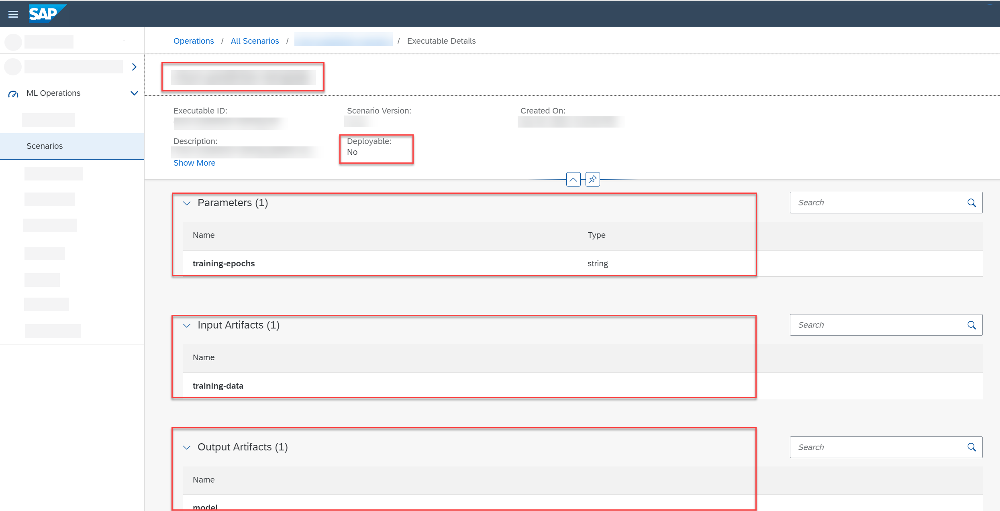

<!-- loio799bb31eba1c4815a1afb2774340fddd -->

# Workflow Executables

An executable that is used to train an AI model or perform batch inferencing is called a workflow executable.

Like any other executable, a workflow executable contains placeholders for input artifacts \(datasets in most cases\) and parameters. The values for these placeholders are provided by creating a configuration.

> ### Example:  
> In SAP AI Core, a workflow executable can be an Argo workflow template. For more information, see [Workflow Template](https://help.sap.com/viewer/2d6c5984063c40a59eda62f4a9135bee/LATEST/en-US/83523ab8b49245bcbc9f1bf0969e32d8.html).

The following is an example of a workflow executable.

-   The scenario name is included in the menu path.
-   The executable name, executable ID, description, and version are displayed in the header.

-   The *Deployable* field indicates whether the executable is intended for training or deployment purposes. A `No` value indicates that the executable is intended for training.

-   The *Input Artifacts* section contains the dataset.

-   The *Output Artifacts section* contains the name of the model that will be generated.

Workflow steps:

1.  Create a configuration to combine a dataset with a placeholder \(input artifact\), and set values \(integer, string or float\) for the parameter placeholders of the workflow executable.
2.  Start the training process by choosing *Create Execution* on the configuration details screen.
3.  Upon completion, the execution results in an AI model with the same name as the output artifact mentioned in the workflow executable.

> ### Note:  
> SAP AI Launchpad is an interface to your AI runtime, therefore the workflow executable \(scenario inclusive\) is present in your selected runtime connection.

**Related Information**  

[Executions](executions-6a6afd5.md "An execution is a training process or batch inferencing process for an AI scenario. The behavior of an execution is determined by the code pieces in the workflow executable.")

[Configurations](configurations-3c9d504.md "Configurations combine artifacts (such as datasets or models) with executables, so that training or deployment processes can be undertaken.")

