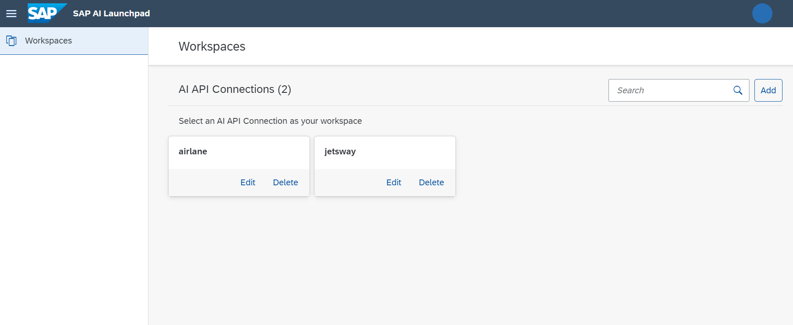

<!-- loio6bde2c8d063d4626bbb0e42d9f08a843 -->

# Workspaces

The *Workspaces* app is a dashboard to manage the connection between SAP AI Launchpad and subscribed AI services.

As an AI scenario consumer, you use SAP AI Launchpad to explore the AI scenarios for connected AI services.

You use the *Workspaces* app to add connections to one or more subscribed AI services, and switch between them to carry out further actions.

<a name="loio6bde2c8d063d4626bbb0e42d9f08a843__section_i3y_pjk_wqb"/>

## Accessing the App

The *Workspaces* app is available in SAP AI Launchpad from the navigation panel.

<a name="loio6bde2c8d063d4626bbb0e42d9f08a843__section_smt_yfw_4rb"/>

## Key Tasks

Before a workspace can be used, an AI administrator must complete the following tasks:

-   [Add Connection](add-connection-867cf53.md)

-   [Manage a Connection](manage-a-connection-7387401.md)
-   [Assign Connection to Workspace](assign-connection-to-workspace-c05f144.md)

<a name="loio6bde2c8d063d4626bbb0e42d9f08a843__section_pwz_pjk_aaa"/>

## Role Requirements

AI administrators are assigned the role `connections_editor`.

-   **[Add Connection](add-connection-867cf53.md "You add an AI API connection to link SAP AI Launchpad to your
		subscribed AI service.")**  
You add an AI API connection to link SAP AI Launchpad to your subscribed AI service.
-   **[Manage a Connection](manage-a-connection-7387401.md "You can delete or edit a connection from the overview page of the Workspaces app.")**  
You can delete or edit a connection from the overview page of the *Workspaces* app.
-   **[Assign Connection to Workspace](assign-connection-to-workspace-c05f144.md " ")**  
 

