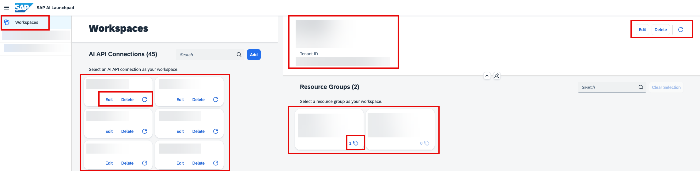

<!-- loioc804f14fb90b40649c1ee172d1f75574 -->

# Workspaces

You use the *Workspaces* app to create and manage connections between SAP AI Launchpad and your AI runtimes \(for example, SAP AI Core\). The app lets you switch between your AI runtime instances so that you can carry out further actions.

AI runtimes provides resources to process AI activities such as training and inference. You can connect any AI runtime that implements the AI API to SAP AI Launchpad. For more information, see [AI API](https://help.sap.com/viewer/2d6c5984063c40a59eda62f4a9135bee/LATEST/en-US/716d4c38e3054c93a9d481b51cc66298.html).

<a name="loioc804f14fb90b40649c1ee172d1f75574__section_i3y_pjk_wqb"/>

## Accessing the App

You'll find the *Workspaces* app in SAP AI Launchpad in the left navigation panel.

After selecting a connection in *Workspaces* app, you then set the resource group as a context in which to perform ML operations. You can switch between connections and the resource groups they contain at any time. For more information, see [Resource Groups](https://help.sap.com/viewer/2d6c5984063c40a59eda62f4a9135bee/CLOUD/en-US/26c6c6b50e3f412f8bc0cd6a8ebdb850.html).

Users can edit, delete, and refresh connections. Refreshing a connection fetches the capability metadata of the underlying AI runtime \(and the specific implementation of the AI API\).

For more information about capabilities, their implementaton, and their effect on the SAP AI Launchpad user interface, see [Custom Runtime Capabilities Using the Meta API](custom-runtime-capabilities-using-the-meta-api-ac3d92b.md) and [AI API Runtime Implementations](https://help.sap.com/docs/AI_CORE/52b4adb30e6744709d6226d2b0659dea/dbacc5fee07c4e43a656f5d1203654c7.html).

> ### Note:  
> In addition to the manual refresh option, SAP AI Launchpad automatically refreshes connections and capability metadata periodically.

<a name="loioc804f14fb90b40649c1ee172d1f75574__section_fbx_r55_4rb"/>

## Key Tasks

Before you can carry out any AI operations in SAP AI Core, your system administrator must complete the following tasks within the *Workspaces* app:

-   [Add Connection to SAP AI Core](add-connection-to-sap-ai-core-71dfe2c.md)
-   [Manage a Connection](manage-a-connection-555c83b.md#loio555c83b997db49ae9f3c302b60bf4062)
-   [Set Resource Group](set-resource-group-0c07728.md#loio0c077289f29d4147921fb07ab0f68b7f)

-   **[Add Connection to SAP AI Core](add-connection-to-sap-ai-core-71dfe2c.md "As an administrator, you can add multiple connections to different instances of SAP AI Core. You can
		enter the service key details for a connection manually, or upload a service key file. ")**  
As an administrator, you can add multiple connections to different instances of SAP AI Core. You can enter the service key details for a connection manually, or upload a service key file.
-   **[Manage a Connection](manage-a-connection-555c83b.md#loio555c83b997db49ae9f3c302b60bf4062 "As an administrator, you can delete, update, or refresh a connection using the
			Workspaces
		app.")**  
As an administrator, you can delete, update, or refresh a connection using the *Workspaces* app.
-   **[Set Resource Group](set-resource-group-0c07728.md#loio0c077289f29d4147921fb07ab0f68b7f "You select a connection and resource group so that you can complete tasks within the ML
                                    Operations app.")**  
You select a connection and resource group so that you can complete tasks within the *ML Operations* app.

